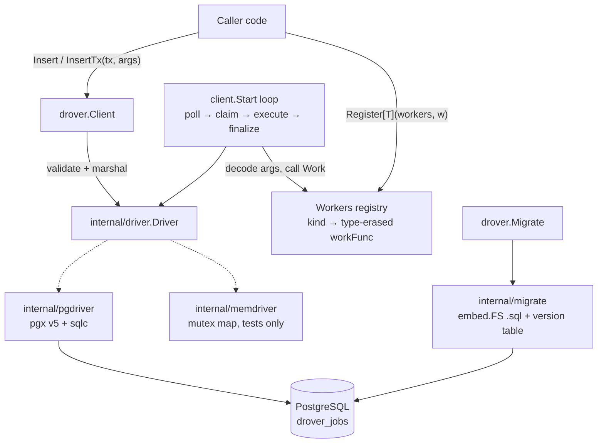

# Cycle A — Walking Skeleton Design

**Spec**: `.specs/features/cycle-a-walking-skeleton/spec.md`
**Status**: Approved (auto-selected recommended approach per run instructions; constraints from ADR-0002/0003/0004 and STATE.md AD-001..008)

## Approach exploration

- **A — Root package orchestrates over an internal driver interface ★ (chosen).** Public API (`Client`, `Worker[T]`, `Register`, `Migrate`) in package `drover`; storage behind `internal/driver.Driver` with pgx+sqlc and in-memory implementations. Matches ADR-0002/0004 and River's shape; unit suite runs Docker-free.
- **B — Public driver package from day one (`droverdriver`).** Premature: no second real driver exists; expands the v0 API surface we must keep stable (rejected by AD-008).
- **C — No interface, pgx directly in Client.** Simplest, but unit tests would all need Docker, violating the spec's success criteria.

## Architecture Overview



## Code Reuse Analysis

Greenfield — no existing code. External patterns deliberately mirrored: River's `JobArgs`/`Worker[T]`/`AddWorker` API shape and self-owned migrator; Asynq's claim-execute-finalize loop structure. Evidence: `docs/research/2026-07-22/rq01`, `rq04`.

## Components

### Package `drover` (root)

- **Purpose**: Entire public API.
- **Location**: `job.go`, `errors.go`, `worker.go`, `client.go`, `migrate.go`, `doc.go`
- **Interfaces**:
  - `type JobArgs interface { Kind() string }`
  - `type Job[T JobArgs] struct { ID int64; Attempt int; CreatedAt time.Time; Args T }`
  - `type Worker[T JobArgs] interface { Work(ctx context.Context, job *Job[T]) error }`
  - `func NewWorkers() *Workers` / `func Register[T JobArgs](ws *Workers, w Worker[T])` — builds a type-erased `func(ctx, *driver.JobRow) error`; panics on duplicate kind (AD-007)
  - `type Config struct { Workers *Workers; Logger *slog.Logger; PollInterval time.Duration }` (config struct per ADR-0004; zero values defaulted: logger→`slog.Default()`, interval→1s)
  - `func NewClient(pool *pgxpool.Pool, cfg Config) (*Client, error)` — nil pool ⇒ error; internal `newClient(d driver.Driver, cfg Config)` for tests
  - `(*Client) Insert(ctx, args JobArgs) (*JobRow, error)` / `InsertTx(ctx, tx pgx.Tx, args JobArgs) (*JobRow, error)` — empty kind ⇒ `ErrInvalidKind`; marshal failure ⇒ wrapped error
  - `(*Client) Start(ctx) error` — blocking single-worker poll loop; returns after in-flight job finishes when ctx is cancelled (CORE-03 AC6)
  - `func Migrate(ctx, pool *pgxpool.Pool) error`
- **Dependencies**: `internal/driver`, `internal/pgdriver`, `internal/migrate`, `log/slog`
- **Sentinels**: `ErrInvalidKind`; states as `JobState` string consts (`StateAvailable`, … per AD-002)

### `internal/driver`

- **Purpose**: The narrow storage contract (AD-008) plus shared row/param types.
- **Interfaces**: `Driver` with `Insert(ctx, InsertParams) (*JobRow, error)`, `InsertTx(ctx, tx any, InsertParams) (*JobRow, error)`, `FetchAvailable(ctx, queue string, limit int) ([]*JobRow, error)` (sets `running` + `leased_until`), `MarkCompleted(ctx, id int64) error`, `MarkDead(ctx, id int64, errDetail []byte) error`. Invalid transition ⇒ `driver.ErrInvalidTransition` (spec dimensions sweep).

### `internal/pgdriver`

- **Purpose**: Production driver: pgx v5 + sqlc-generated queries (`internal/dbsqlc`, committed per ADR-0004). Claim query per AD-004: `state='available' AND scheduled_at <= now() ORDER BY id LIMIT $2 FOR UPDATE SKIP LOCKED`, single UPDATE…FROM sub-select.

### `internal/memdriver`

- **Purpose**: Mutex-guarded in-memory `Driver` for the Docker-free unit suite; enforces the same transition guards. `InsertTx` unsupported ⇒ documented error (transactions are a Postgres capability, ADR-0002).

### `internal/migrate`

- **Purpose**: Apply embedded `NNN_name.sql` files transactionally, tracked in `drover_schema_version` (AD-001). Migration 001 creates enum (7 states, AD-002) + `drover_jobs` (columns per CORE-01 AC3) + partial index on `(queue, scheduled_at, id) WHERE state='available'`.

## Data Models

```sql
CREATE TYPE drover_job_state AS ENUM
  ('available','scheduled','running','retryable','completed','cancelled','dead');

CREATE TABLE drover_jobs (
  id           bigint GENERATED ALWAYS AS IDENTITY PRIMARY KEY,
  kind         text NOT NULL,
  queue        text NOT NULL DEFAULT 'default',
  args         jsonb NOT NULL DEFAULT '{}',
  state        drover_job_state NOT NULL DEFAULT 'available',
  attempt      int NOT NULL DEFAULT 0,
  max_attempts int NOT NULL DEFAULT 25,
  errors       jsonb NOT NULL DEFAULT '[]',
  scheduled_at timestamptz NOT NULL DEFAULT now(),
  leased_until timestamptz,
  created_at   timestamptz NOT NULL DEFAULT now(),
  finalized_at timestamptz
);
```

## Error Handling Strategy

| Error Scenario | Handling | Caller impact |
|---|---|---|
| Empty `Kind()` | `ErrInvalidKind` before any I/O | `errors.Is` checkable |
| JSON marshal failure | wrapped error, nothing persisted | insert fails loudly |
| Handler returns error | error JSON appended to `errors`, state `dead` (AD-003) | slog ERROR record |
| Handler panics | `recover` at job boundary, `debug.Stack()` captured, state `dead`; loop continues | slog ERROR record |
| Unregistered kind claimed | state `dead`, "unregistered kind" error | slog WARN record |
| Args decode failure at execution | state `dead` with decode error | slog ERROR record |
| DB unreachable at poll | slog ERROR, wait one `PollInterval`, retry (AD-006) | loop self-heals |
| Invalid state transition | `driver.ErrInvalidTransition` | guards AD-002 |

## Risks & Concerns

| Concern | Location | Impact | Mitigation |
|---|---|---|---|
| sqlc generated code drifts from `.sql` sources | `internal/dbsqlc/` | stale queries compiled | committed codegen + `sqlc diff`/generate check in CI task (T10) |
| Integration tests need Docker | `*_integration_test.go` | suite fails on Docker-less machines | `//go:build integration` tag; unit suite (memdriver) is the default gate |
| `UPDATE … FROM sub-select FOR UPDATE SKIP LOCKED` correctness | `internal/pgdriver` | double-claim if wrong | dedicated concurrent-claim integration test (CORE-03 AC2) at driver level AND end-to-end |
| goroutine leak in loop shutdown | `client.go` | resource leak in adopters | goleak assertion in loop tests (CORE-03 AC6) |

## Tech Decisions (feature-local)

| Decision | Choice | Rationale |
|---|---|---|
| Type erasure point | `Register[T]` builds `func(ctx, *driver.JobRow) error` closures | generics stay at the API edge; loop stays monomorphic |
| Claim batch size in A | `LIMIT 1` via `FetchAvailable(…, limit)` param | single worker (RFC Cycle A); batch param already in the contract for Cycle C |
| `InsertTx` tx type | `pgx.Tx` in public API | ADR-0004 pins pgx; `database/sql` documented future work |
| Loop idle behavior | `time.Timer` wait on `PollInterval`, ctx-aware | testable with short intervals; synctest reserved for Cycle B timing logic |
