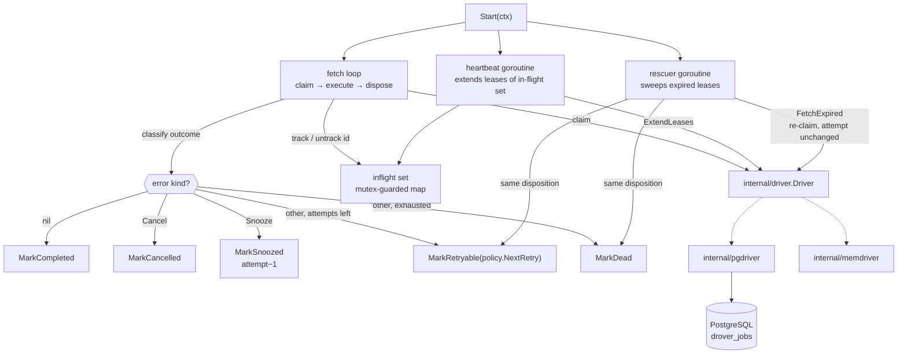

# Cycle B — Reliability Core Design

**Spec**: `.specs/features/cycle-b-reliability-core/spec.md`
**Status**: Approved (auto-selected recommended approach per the ship-cycle autonomy contract;
constraints from ADR-0002/0003/0004, AD-001..AD-008, and this cycle's AD-009..AD-018)

## Approach exploration

- **A — Retry disposition decided in Go, persisted through new narrow driver transitions ★
  (chosen).** The loop classifies each attempt's outcome (success / cancel / snooze / retry / die),
  the retry policy computes the next run time in Go, and the driver gains one guarded transition per
  outcome. Rescue re-enters the same transitions by re-claiming expired rows. Keeps the pluggable
  `RetryPolicy` real, keeps the driver dumb, and works identically on both drivers.
- **B — Disposition decided in SQL.** A single `UPDATE ... CASE WHEN attempt >= max_attempts` per
  failure, with backoff arithmetic in SQL. Fewer round trips, but the retry curve becomes untunable
  from Go, contradicting ADR-0003's pluggable policy, and the in-memory driver would have to
  re-implement the branch by hand anyway.
- **C — A separate reliability component outside the loop** (a supervisor that owns retries, leases
  and rescue). Cleaner separation on paper, but every one of those mechanisms needs the job outcome
  or the in-flight set, which live in the loop; the indirection buys nothing until Cycle C's pool
  exists, and Cycle C is where the loop is restructured anyway.

## Architecture Overview



## Code Reuse Analysis

Everything extends Cycle A rather than replacing it. `runJob` keeps its `runProtected` panic
boundary and its structured-logging shape; only the disposition branch changes. `markDead`'s error
encoding generalizes into a shared `attemptError` helper used by all four failure transitions. The
`finalizeFailure` diagnostic in `pgdriver` (which explains a zero-row guarded UPDATE as "not found"
vs "wrong state") is reused unchanged by every new transition. `memdriver.finalize` already takes a
target state and an optional error blob, so the new terminal transitions are parameter changes, not
new code paths.

External lineage, per `docs/research/2026-07-22/rq03`: River's `JobCancel`/`JobSnooze` sentinels and
its `ClientRetryPolicy.NextRetry(job) time.Time` signature; Sidekiq's `attempt^4` curve.

## Components

### Package `drover` (root) — public surface added

- **`retry.go`** (new)
  - `type RetryPolicy interface { NextRetry(job *JobRow) time.Time }` — POLICY-02.
  - `type ExponentialRetryPolicy struct{}` with `NextRetry` returning
    `now + (job.Attempt⁴ seconds × uniform[0.9, 1.1])`, floored at zero. Exported so an adopter can
    embed or delegate to it. POLICY-01.
  - `func retryAt(p RetryPolicy, job *JobRow, now time.Time) time.Time` — unexported: applies the
    policy, recovers a panicking policy back onto the default, and clamps a past answer to `now`
    (POLICY-02 AC6, edge case 1).
- **`errors.go`** (extended)
  - `func Cancel(err error) error` — wraps `err` so the loop finalizes the job as `cancelled`.
    `errors.Is(returned, ErrCancelled)` is the classification test, so `%w` wrapping by the caller
    is transparent (SENT-03).
  - `func Snooze(d time.Duration) error` — an error carrying a duration; the loop defers the job by
    `d`, clamped to a non-negative value.
  - `var ErrCancelled`, and an unexported `snoozeError` implementing `error` with a `Duration()`
    accessor, retrieved with `errors.As`.
- **`client.go`** (extended)
  - `Config` gains `RetryPolicy RetryPolicy`, `LeaseDuration`, `HeartbeatInterval`,
    `RescueInterval time.Duration`. Defaults applied in `newClient`: nil policy →
    `ExponentialRetryPolicy{}`; non-positive durations → 1 minute, lease/3, 1 minute respectively;
    a heartbeat interval ≥ the lease is clamped to lease/3 (edge cases 5–6).
  - `Client` gains `inflight *inflightSet`.
- **`loop.go`** (reworked)
  - `Start` becomes a supervisor: it starts the rescuer under a cancellable child of `ctx`, starts
    the heartbeat under its own stop channel, runs the fetch loop as today, and on exit closes the
    heartbeat stop channel, cancels the rescuer, and waits on both before returning (LEASE-03).
  - `runJob` tracks the id in the in-flight set before execution and untracks it in a `defer`, then
    dispatches on the classified outcome.
  - `dispose(ctx, row, err, stack)` — the single classifier, shared by the fetch loop and the
    rescuer, implementing the RETRY-01/03 and SENT-01/02 branches.
- **`inflight.go`** (new) — `inflightSet`: a mutex-guarded `map[int64]struct{}` with `add`,
  `remove`, `ids() []int64`, and `len()`. Sized for one job today, correct for Cycle C's pool.
- **`heartbeat.go`** (new) — `(*Client) heartbeat(stop <-chan struct{})`: every
  `HeartbeatInterval`, snapshot the in-flight ids and call `ExtendLeases`; log and continue on error
  (LEASE-02 AC4).
- **`rescue.go`** (new) — `(*Client) rescueLoop(ctx)` and `(*Client) rescueOnce(ctx) (int, error)`:
  `FetchExpired` a bounded batch, then run each row through the same `dispose` used for a failed
  attempt, with a synthetic lease-expiry error (RESCUE-01..03).

### `internal/driver` — contract additions

```go
type Driver interface {
    // ... Cycle A methods unchanged ...
    FetchExpired(ctx context.Context, leaseUntil time.Time, limit int) ([]*JobRow, error)
    ExtendLeases(ctx context.Context, ids []int64, until time.Time) error
    MarkRetryable(ctx context.Context, id int64, retryAt time.Time, errDetail []byte) error
    MarkCancelled(ctx context.Context, id int64, errDetail []byte) error
    MarkSnoozed(ctx context.Context, id int64, runAt time.Time) error
}
```

- `FetchExpired` re-claims rows that are `running` with `leased_until <= now()`, writing a fresh
  `leased_until` and **not** touching `attempt` (AD-012). `FOR UPDATE SKIP LOCKED` gives
  exactly-once disposition across concurrent sweeps (RESCUE-03 AC7).
- `ExtendLeases` sets `leased_until = until` for the given ids **only where state is `running`**, so
  a heartbeat that races a finalize cannot resurrect a finalized row (edge case 8). An id that
  matches nothing is not an error — it means the job finished first.
- `MarkRetryable` / `MarkCancelled` / `MarkSnoozed` are guarded on `state = 'running'` exactly like
  the Cycle A finalizers, and report `ErrInvalidTransition` / `ErrNotFound` through the same
  `finalizeFailure` diagnostic.
- `DefaultLeaseDuration` stays in `internal/driver` as the shared default constant but is now read
  through `Config.LeaseDuration`.

### `internal/pgdriver` + `internal/dbsqlc`

New sqlc queries in `internal/pgdriver/queries.sql`, regenerated into the committed `internal/dbsqlc`:

| Query | Shape |
| --- | --- |
| `FetchAvailable` (amended) | predicate widened to `state IN ('available','retryable','scheduled')` |
| `FetchExpired` | `UPDATE ... SET leased_until = $1 WHERE id IN (SELECT id ... WHERE state = 'running' AND leased_until <= now() ORDER BY id LIMIT $2 FOR UPDATE SKIP LOCKED) RETURNING *` |
| `ExtendLeases` | `UPDATE ... SET leased_until = $1 WHERE id = ANY($2) AND state = 'running'` |
| `MarkRetryable` | `SET state='retryable', scheduled_at=$2, leased_until=NULL, errors = errors \|\| $3 WHERE id=$1 AND state='running'` |
| `MarkCancelled` | `SET state='cancelled', finalized_at=now(), leased_until=NULL, errors = errors \|\| $2 WHERE id=$1 AND state='running'` |
| `MarkSnoozed` | `SET state='scheduled', scheduled_at=$2, leased_until=NULL, attempt=GREATEST(attempt-1,0) WHERE id=$1 AND state='running'` |

`MarkCompleted` and `MarkDead` additionally clear `leased_until`, so no finalized row carries a
stale lease that could confuse a later sweep or a human reading the table.

### `internal/memdriver`

Mirrors every transition with the same guards, the same `attempt` arithmetic, and the same
`GREATEST(attempt-1, 0)` floor. `FetchExpired` selects `running` rows with a non-nil `leased_until`
at or before now, ordered by id, and rewrites the lease under the existing mutex — which is what
makes the concurrent-rescue property testable without Docker.

### `internal/migrate` — migration 002

```sql
DROP INDEX drover_jobs_fetch_idx;

CREATE INDEX drover_jobs_fetch_idx
  ON drover_jobs (queue, scheduled_at, id)
  WHERE state IN ('available', 'retryable', 'scheduled');

CREATE INDEX drover_jobs_lease_idx
  ON drover_jobs (leased_until)
  WHERE state = 'running';
```

No column changes: AD-004 provisioned `attempt`, `max_attempts`, `errors`, `scheduled_at` and
`leased_until` in migration 001 precisely so this cycle would be an index and behavior change only.

## Data Models

The `errors` array element gains no new fields; a rescue writes an ordinary `AttemptError` whose
`error` message names the expired lease, so every consumer that already reads the array keeps
working:

```json
{"attempt": 3, "at": "2026-07-25T20:14:02Z", "error": "lease expired: worker presumed dead"}
```

## State transitions after this cycle

| From | Trigger | To | `attempt` | `errors` | `finalized_at` |
| --- | --- | --- | --- | --- | --- |
| `available` / `retryable` / `scheduled` (due) | claim | `running` | +1 | — | — |
| `running` | handler returns nil | `completed` | — | — | set |
| `running` | handler error / panic / unregistered kind, attempts left | `retryable` | — | +1 | — |
| `running` | same, attempts exhausted | `dead` | — | +1 | set |
| `running` | handler returns `Cancel` | `cancelled` | — | +1 | set |
| `running` | handler returns `Snooze(d)` | `scheduled` | −1 (floor 0) | — | — |
| `running` | lease expired, rescued, attempts left | `retryable` | unchanged | +1 | — |
| `running` | lease expired, rescued, exhausted | `dead` | unchanged | +1 | set |

## Error Handling Strategy

| Error Scenario | Handling | Caller impact |
| --- | --- | --- |
| Handler returns a plain error | retry with backoff, or `dead` at the ceiling (replaces AD-003) | slog WARN on retry, ERROR on death |
| Handler panics | recovered at the job boundary, stack stored, treated as a plain error (AD-013) | loop survives; job retries |
| Unregistered kind claimed | treated as a plain error (AD-014) | slog WARN; job retries |
| Args decode failure | treated as a plain error; will exhaust attempts and die | recorded per attempt |
| Handler returns `Cancel(err)` | `cancelled`, reason recorded, no retry | terminal, inspectable |
| Handler returns `Snooze(d)` | `scheduled` at `now+d`, attempt restored | no attempt consumed |
| Retry policy panics or returns a past time | recover onto the default policy / clamp to now | job never stuck in `running` |
| `ExtendLeases` fails | logged, loop and job continue; the lease may lapse and the rescuer may duplicate | documented at-least-once cost |
| `FetchExpired` or a rescue write fails | logged, sweep aborts, next tick retries | self-healing |
| Finalize write fails | logged, loop continues; lease expiry is the backstop | job is rescued later |

## Risks & Concerns

| Concern | Location | Impact | Mitigation |
| --- | --- | --- | --- |
| The rescuer duplicating a live job | `rescue.go` / heartbeat | at-least-once becomes at-least-twice routinely | heartbeat at lease/3 with a hard clamp below the lease; a dedicated test runs a job for several lease durations under an active sweeper and asserts one execution |
| Heartbeat stopping at ctx cancellation | `loop.go` | draining job's lease lapses, duplicate handed out during every shutdown | AD-018: the heartbeat stops only after the fetch loop returns; asserted by a cancel-mid-job test |
| Widened fetch predicate silently claiming not-yet-due rows | `queries.sql` | retries fire immediately, becoming a busy loop | the `scheduled_at <= now()` gate is asserted directly by a not-yet-due test on both drivers |
| `attempt` drift between the snooze decrement and the claim increment | drivers | snooze either consumes an attempt or lets `attempt` go negative | floored decrement in both drivers plus a repeated-snooze test asserting `attempt` never rises and `dead` is never reached |
| A timing test that passes under a busy loop | new timing tests | a test that discriminates nothing | timing assertions state both bounds (never a lower bound alone) and use `testing/synctest` for the heartbeat and rescue intervals |
| Goroutine leak from the two new background loops | `loop.go` | leak in every adopter | `goleak` on the lifecycle tests, extended to cover cancel-during-drain |
| Generated sqlc code drifting from the amended `.sql` | `internal/dbsqlc` | stale queries compiled | regenerate and commit in the same task that edits `queries.sql` |

## Tech Decisions (feature-local)

| Decision | Choice | Rationale |
| --- | --- | --- |
| Sentinel representation | `Cancel` wraps into an `errors.Is`-checkable sentinel; `Snooze` returns a typed error read with `errors.As` | cancellation carries a reason (so it wraps), a snooze carries a duration (so it needs a type) |
| Rescue batch size | fixed internal batch, one sweep drains repeatedly until a short batch | keeps a backlog of thousands of expired rows from being swept one tick at a time, with no new config knob |
| Where the classifier lives | one `dispose` function used by both the fetch loop and the rescuer | a crashed job and a failed job must reach identical outcomes; sharing the function is what guarantees it |
| Timing tests | `testing/synctest` for interval behavior, real short durations for end-to-end | Go 1.26 ships `synctest` stable; deterministic ticks beat sleep-and-hope |
| `attempt` on rescue | unchanged (AD-012) | the stranded attempt was really spent |
