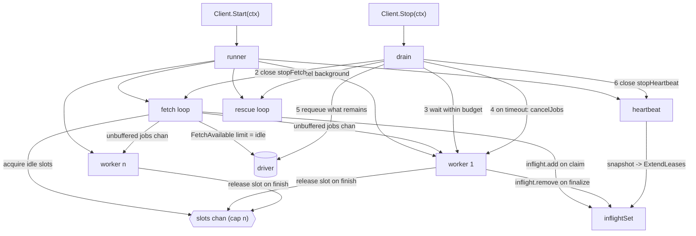

# Concurrency: Worker Pool and Graceful Shutdown — Design

**Spec**: `.specs/features/cycle-c-concurrency/spec.md`
**Decisions**: `.specs/features/cycle-c-concurrency/context.md` (D-1 … D-8)
**Status**: Approved (auto — ship-cycle autonomy contract)

---

## Conformance to active project decisions

Read from `.specs/STATE.md` `## Decisions` before designing. Every active `AD-NNN` is **conformed to**; none is superseded by this cycle.

| Active decision | How this design conforms |
| --- | --- |
| AD-004 (schema already Cycle-D-shaped) | No schema change. `queue` is threaded through the runner as a field so Cycle D adds a second runner rather than restructuring the first. |
| AD-009 / AD-015 (retryable + `scheduled_at`; a past answer means claimable now) | Shutdown requeue writes `scheduled_at = now`, which the existing fetch predicate already treats as claimable. No predicate change. |
| AD-012 (rescue never changes `attempt`) | The shutdown requeue follows the same rule and for the same reason — see D-6. |
| AD-016 (rescuer re-claims with a fresh lease, reuses ordinary transitions) | Unchanged. The rescuer is stopped at the start of shutdown because it *claims*, and shutdown must stop all claiming. |
| AD-018 (heartbeat stops after the fetch loop, not at cancellation) | **Generalised**: the heartbeat now stops after the last pool worker drains, not after the fetch loop returns. Same principle, wider scope. This is a strengthening, not a supersession. |
| AD-019 (every state change fenced on `Lease{ID, Attempt}`) | Every new write — the shutdown requeue — is fenced. D-6 rejects the option that would have broken the fence. |
| AD-020 (database computes lease deadlines) | No new lease arithmetic anywhere; the requeue passes an instant for `scheduled_at`, which is a schedule, not a lease. |

---

## Architecture Overview

One `Client` owns one `runner`: a fetch loop, a fixed pool of worker goroutines, and the lifecycle state that starts and stops them together. The fetch loop never claims more jobs than there are idle workers, so a claimed row is always one a worker is about to execute.



**Shutdown ordering is the load-bearing part** and follows ADR-0003:29 literally: stop claiming → drain within the caller's budget → cancel per-job contexts → best-effort requeue. The heartbeat is stopped *last*, after the drain and the requeue, so no draining job ever loses its lease (AD-018 generalised).

---

## Code Reuse Analysis

### Existing components leveraged

| Component | Location | How used |
| --- | --- | --- |
| `inflightSet` | `inflight.go:24` | Unchanged. Its doc comment already anticipates the pool. The only change is **who** calls `add`: the fetch loop now adds at claim time rather than the executor adding at execution time, which closes the window where a claimed-but-undispatched row would hold an unrenewed lease. |
| `heartbeat` / `extendLeases` | `heartbeat.go:22,37` | Unchanged in body. It already batches every lease in the snapshot into one `ExtendLeases` call, so it covers `n` in-flight jobs with no edit. Only its stop signal moves. |
| `runJob` / `runProtected` / `dispose` | `loop.go:85,124,147` | `runJob` becomes the per-worker unit, called from `n` goroutines instead of one. `dispose` and `runProtected` are unchanged in behaviour; `runJob`'s single `ctx` parameter splits into two (see D-7). |
| `MarkRetryable` | `internal/driver/driver.go:127` | Reused verbatim as the shutdown requeue. No driver-interface change, no new SQL, no `sqlc` regeneration, so the `sqlc-drift` CI job stays green without a generated diff. |
| `rescueLoop` | `rescue.go:34` | Unchanged. It is now cancelled at the *start* of shutdown rather than at loop-context cancellation, because `FetchExpired` claims rows and shutdown must stop all claiming. |
| `sleep` | `loop.go:234` | Reused by the fetch loop for poll cadence and fetch-error backoff, with its wake-up condition widened to the stop signal so shutdown does not wait out a poll interval. |
| `goleak` + `testing/synctest` patterns | `loop_test.go`, `heartbeat_test.go`, `rescue_test.go` | The existing lifecycle-test idiom carries over directly; every new lifecycle test uses `goleak.VerifyNone`. |

### Integration points

| System | Integration |
| --- | --- |
| `driver.Driver` | No interface change. `FetchAvailable`'s existing `limit` parameter carries the idle-worker count. |
| Database schema | No change. |
| `.github/workflows/ci.yml` | No change — `-race` already runs on unit and integration jobs. |

---

## Components

### `runner` — one queue's running pool

- **Purpose**: own the fetch loop, the worker goroutines, and the lifecycle state that starts and stops them as a unit.
- **Location**: `pool.go` (new)
- **Why a struct rather than more `Client` fields**: the lifecycle state (channels, cancel funcs, wait groups) is per-run, not per-client. Keeping it in a value that is created by `Start` and discarded by `Stop` means there is no half-initialised state to reason about, and Cycle D adds a second `runner` for a second queue without touching `Client`.

```go
type runner struct {
    client      *Client
    queue       string
    concurrency int

    jobs  chan *driver.JobRow // unbuffered: a send means a worker took it
    slots chan struct{}       // capacity tokens, buffered to concurrency

    stopFetch chan struct{} // closed to stop claiming
    goroutines sync.WaitGroup // fetch loop + workers
    background sync.WaitGroup // heartbeat + rescuer

    stopHeartbeat  chan struct{}
    cancelBackground context.CancelFunc // stops the rescuer
    fetchCtx       context.Context

    jobCtx     context.Context    // handlers run on this; cancellable
    cancelJobs context.CancelFunc // shutdown escalation

    shutdown sync.Once
    done     chan struct{} // closed when drain has completed
    stopErr  error         // written before done closes
}
```

- **Interfaces**:
  - `(*runner) fetch()` — the claim loop.
  - `(*runner) work()` — one pool worker.
  - `(*runner) stop(ctx) error` — once-guarded; runs `drain` or waits for the in-progress one.
  - `(*runner) drain(ctx) error` — the ordered shutdown.
  - `(*runner) acquireSlots() int` / `(*runner) releaseSlots(n int)` — idle-capacity accounting.
- **Dependencies**: `Client` (driver, logger, intervals, inflight set).

### Capacity accounting — how `POOL-03` is enforced

`slots` is a buffered channel pre-filled with `concurrency` tokens. One token means one idle worker.

- `acquireSlots` blocks for the **first** token (or returns 0 if shutdown started), then takes as many more as are immediately available without blocking. The count it returns is the fetch limit.
- The fetch loop returns unused tokens when the driver hands back fewer rows than requested, or on a fetch error.
- A worker returns its token after the job is finalized — never before, so a token always means genuinely idle.

Tokens are conserved: total tokens in flight never exceed `concurrency`, so the worker's send to `slots` can never block.

**Why this and not a buffered `jobs` channel:** see D-2. A buffered channel holds claimed rows nothing is executing — rows that are `running` in the database, holding live leases, invisible to any operator looking at the pool.

### Fetch loop

```
loop:
  if stopping -> return
  n := acquireSlots()            // blocks until at least one worker is idle
  if n == 0 -> return            // shutdown
  rows := FetchAvailable(fetchCtx, queue, leaseDuration, n)
    on error   -> releaseSlots(n); log; back off one poll interval; continue
    on empty   -> releaseSlots(n); back off one poll interval; continue
  releaseSlots(n - len(rows))    // driver gave fewer than asked
  for i, row := range rows:
      inflight.add(lease(row))   // heartbeat covers it from the moment of claim
      select:
        jobs <- row              // a worker has taken it
        <-stopFetch  -> requeue(rows[i:]); releaseSlots(len(rows)-i); return
defer: close(jobs)               // workers exit when the channel drains
```

Two details that carry weight:

1. **`inflight.add` happens at claim, not at execution.** This is the fix for the trap named in the brief: a row claimed and sitting in the handoff is exactly a row whose lease must not lapse.
2. **The handoff select has a stop arm.** Without it, shutdown would block behind a send no worker will ever receive. The rows the fetcher still holds are requeued by the fetcher itself — spec `SHUT-05`.

### Worker

```go
for row := range r.jobs {
    r.client.runJob(r.jobCtx, row)
    r.slots <- struct{}{}
}
```

A panic inside `runJob` is already contained by `runProtected` (`loop.go:124`), so one bad handler cannot take down a worker goroutine, let alone the pool (`POOL-04`).

### `runJob` — the per-job context split

The single `ctx` parameter becomes two distinct contexts, and the distinction is the point (D-7):

| Context | Derivation | Used for | Cancellable? |
| --- | --- | --- | --- |
| `jobCtx` | `WithCancel(WithoutCancel(startCtx))`, one per runner | the handler | **Yes** — by shutdown escalation only |
| `finalCtx` | `WithTimeout(WithoutCancel(jobCtx), leaseDuration)`, one per job | `MarkCompleted` / `dispose` / requeue | No — only the bounded timeout |

**Rule for implementers, stated once:** *the handler's context may be cancelled; the context that records an outcome never is.* Collapsing these two is the failure mode D-7 option (c) describes — every escalated job would fail to record its outcome and sit `running` until its lease lapsed, turning a clean shutdown into the crash path for every affected row.

The `finalCtx` timeout is bounded by `leaseDuration` so a wedged database cannot hang a worker forever; the drain budget in `Stop` is the outer bound regardless.

### `Client.Start(ctx) error`

Non-blocking (D-4). Builds the runner, launches heartbeat, rescuer, fetch loop, `concurrency` workers, and one watcher goroutine, then returns `nil`.

The watcher exists so that cancelling `Start`'s context performs the **whole** shutdown, not merely the beginning of it (`SHUT-01` AC10):

```go
select {
case <-ctx.Done(): r.stop(context.Background()) // full drain, unbounded budget
case <-r.done:                                   // an explicit Stop got there first
}
```

An unbounded budget here reproduces today's semantics exactly: under the current code, cancelling `Start`'s context lets the in-flight job finish however long it takes. Because `stop` is once-guarded and the waiter path only reads `done`, an explicit `Stop` racing the watcher cannot deadlock — whichever arrives first runs the drain and the other waits on `done`.

### `Client.Stop(ctx) error` — the drain

```
1. cancelBackground()     // rescuer stops claiming expired rows
2. close(stopFetch)       // fetch loop stops claiming and requeues what it holds
3. wait for fetch loop + workers, bounded by ctx
4. if the budget ran out:
       cancelJobs()                     // handlers observe cancellation
       n := requeue every lease still in the in-flight set
       err = ErrDrainIncomplete wrapped with n
5. close(stopHeartbeat)   // only now — leases were renewed throughout 3 and 4
6. wait for heartbeat + rescuer
```

Steps 1–2 satisfy "no new job is claimed once shutdown begins" (`SHUT-02`); the rescuer is included because `FetchExpired` is a claim.

Step 5's position is the AD-018 generalisation and the single most important ordering constraint in the file: closing the heartbeat before step 3 would strand every draining worker with a lapsing lease and invite the rescuer — this one or another process's — to hand out duplicates on every clean shutdown.

**Lifecycle is single-use.** `Start` on a client that is running or has already run returns `ErrAlreadyStarted`; `Stop` before any `Start` returns `ErrNotStarted`; `Stop` twice returns the first call's result. A restartable client would need the runner rebuilt and every channel re-made for no demonstrated use case, and "this client already had its lifecycle" is a simpler invariant to hold than "this client may have had several".

**Honest about what it cannot do.** Go cannot kill a goroutine. After an incomplete drain, the handler goroutines that ignored cancellation are still running when `Stop` returns — that is why `Stop` returns a count rather than a promise. The requeue is what makes those jobs recoverable by *another* worker in the meantime, and the fence is what stops the abandoned handler from later overwriting the new holder's outcome.

### Shutdown requeue

```go
var errShutdownRequeued = errors.New("drover: worker shut down before this attempt finished")

func (c *Client) requeue(ctx context.Context, lease driver.Lease) error
```

Calls `MarkRetryable(ctx, lease, time.Now(), detail)` where `detail` is the usual `driver.AttemptError` carrying `errShutdownRequeued`. `attempt` is untouched, so the next claim increments it and any late write from the abandoned handler is fenced out (D-6).

A requeue that loses the race with the worker's own finalization reports `ErrInvalidTransition` or `ErrLeaseLost`. Both are expected outcomes of that race, not failures, and are logged as such rather than as errors.

### Example program

- **Location**: `examples/email/` — `main.go` plus `delivery.go` (the stub) and a short `README.md`.
- **Shape**: migrate → register a `SendEmail` worker → enqueue a batch → `Start` with `Concurrency > 1` → wait for SIGINT → `Stop` with a bounded context, reporting the verdict.
- **Flaky delivery stub**: deterministic, in-process, zero dependencies — fails a documented fraction of sends (by hashing the recipient, not by randomness, so a reader can predict which ones retry). Unit-tested for that documented pattern, which is what gives `EX-01`'s retry claim a sensor.
- **Config**: `DATABASE_URL` from the environment; no flags library.

---

## Error Handling Strategy

| Scenario | Handling | Caller impact |
| --- | --- | --- |
| `Start` on an already-started client | Return `ErrAlreadyStarted`; no second pool | Programming error surfaced immediately |
| `Stop` before `Start` | Return `ErrNotStarted` immediately | Ditto |
| `Stop` called twice | Second call returns the first's result | Safe; no double-close |
| Drain budget exhausted | Cancel job contexts, requeue, return `ErrDrainIncomplete` wrapping the count | Caller learns exactly how many jobs did not finish |
| Fetch returns an error | Log, release tokens, back off one poll interval, continue | Pool keeps running; a database blip is not fatal |
| Requeue fails at shutdown | Log and continue with the remaining leases | That row waits out its lease; the rescuer is the backstop |
| Requeue loses the race with the worker's own finalization | `ErrInvalidTransition` / `ErrLeaseLost` logged as expected, not as an error | None |
| Handler panics | Existing `runProtected` boundary → retryable failure with stack | Other workers unaffected |
| Handler ignores cancellation | Requeued and reported in `Stop`'s count; goroutine outlives `Stop` | Documented on `Stop` |

---

## Risks & Concerns

| Concern | Location | Impact | Mitigation |
| --- | --- | --- | --- |
| `Start`'s contract changes from blocking to non-blocking | `loop.go:22`, `example_test.go:53` | Any caller treating `Start` as "run forever" falls through immediately | Pre-1.0, no tagged release, one in-repo caller. The package example is updated in the same task, and the doc comment states the contract explicitly. Cancelling `Start`'s ctx still performs a full shutdown, so the common idiom keeps working. |
| The `loop_test.go` suite is written against a blocking `Start` | `loop_test.go` (14+ tests) | A large mechanical test refactor lands in one task, where a subtle behaviour change could hide | The refactor is confined to the lifecycle call sites; assertions on job outcomes are preserved verbatim. Test count is checked before and after so nothing is silently dropped. |
| The drain-waiter goroutine outlives `Stop` when the budget is exhausted | `pool.go` (`drain`) | `goleak` failures in tests whose handlers never return | Inherent — Go cannot kill a goroutine. Documented on `Stop`. Lifecycle tests use handlers that return on cancellation; the one test that deliberately blocks past the budget releases its handler before `goleak` runs. |
| The watcher goroutine exits just after `Stop` returns | `pool.go` (`Start`) | A `goleak` check racing the watcher's exit | `goleak.VerifyNone` retries with backoff; the watcher's remaining work after `done` closes is a single return. |
| Requeue races the worker's own finalization | `pool.go` (`drain` step 4) | Duplicate disposition attempts on the same row | The fence resolves it: exactly one write lands, the other reports `ErrInvalidTransition`/`ErrLeaseLost` and is logged as expected. |
| `Concurrency` default of 10 against a small `pgxpool` | `client.go` | Brief contention at claim and finalize on a 4-connection pool | Drover holds a connection only across those two operations, never for the handler's duration. Documented on the `Config` field. |
| Existing `heartbeat_test.go` asserts stop-after-fetch-loop timing | `heartbeat_test.go` | Tests encode AD-018's narrow form | Updated to assert the generalised form: the heartbeat stops after the last **worker** drains. |

---

## Tech Decisions

| Decision | Choice | Rationale |
| --- | --- | --- |
| Pool topology | One fetch loop + N workers over an unbuffered channel | ADR-0003:28; D-1 |
| Claim sizing | Exactly the idle-worker count, via capacity tokens | D-2 — makes "claimed but not executing" unrepresentable |
| `Concurrency` default | 10 | D-3 |
| `Start`/`Stop` shape | Non-blocking `Start`, blocking `Stop` | D-4, RFC-0001 |
| Drain budget | `Stop`'s context; no config knob | D-5 |
| Requeue mechanism | Existing `MarkRetryable` at `now`, `attempt` untouched | D-6 — the only fence-safe option |
| Per-job contexts | Handler cancellable, finalization never | D-7 |
| Example location | `examples/email/` | D-8 |
| Lifecycle reuse | Single-use: one `Start`, one `Stop` per client | A restartable pool needs every channel rebuilt for no demonstrated use case; the single-use invariant is easier to hold and to test |
| Rescuer during shutdown | Cancelled at the start of the drain | `FetchExpired` is a claim, and shutdown must stop all claiming |

> **Project-level decisions** promoted to `.specs/STATE.md` as `AD-021`…`AD-028`.
