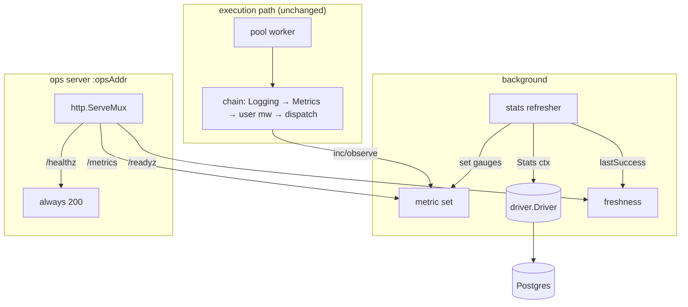

# Observability Design

**Spec**: `.specs/features/cycle-e-observability/spec.md`
**Context**: `.specs/features/cycle-e-observability/context.md`
**Status**: Approved (auto-decided under the ship-cycle rule)

---

## Architecture Overview

Three independent pieces, each attached at an existing seam rather than threaded through
the execution path:

1. **A metric set** (`metrics.go`) owning every `prometheus` collector, registered on a
   registry the client owns.
2. **A middleware** (`metrics.go`) that records per-execution counters, the duration
   histogram, and the in-flight gauge. Installed by the client immediately inside `Logging`
   and ahead of `Config.Middleware` (D-1).
3. **A stats refresher** (`stats.go`) — one goroutine polling a new `driver.Stats` method on
   an interval, writing the queue-derived gauges, and publishing a freshness timestamp that
   `/readyz` reads (D-2, D-7).

An **ops server** (`ops.go`) serves `/metrics`, `/healthz`, and `/readyz` from the client's
registry and the refresher's freshness state. It binds eagerly in `Start` so a bad address
fails loudly (D-6), and it is the last thing shut down (D-10).



The load property the cycle is judged on falls out of the shape: the only edge touching the
database is `refresher → driver`, and it is driven by a `time.Ticker`. No arrow runs from
the ops server to the database, so no scrape and no probe can produce a query.

---

## Code Reuse Analysis

### Existing Components to Leverage

| Component | Location | How to Use |
| --- | --- | --- |
| Middleware chain composition | `client.go:244-247` | Insert `metricsMiddleware(c.metrics)` into the client-installed slice, after `Logging(c.logger)`, before `checkedMiddleware(cfg.Middleware)...`. Preserves AD-033. |
| `Middleware` / `Handler` types | `middleware.go:21,33` | The metrics middleware is an ordinary `Middleware`; no new type. |
| `Logging` as the reference shape | `middleware.go:124-145` | Same structure — time the inner call, branch on the returned error. Read it before writing the metrics one; they should look like siblings. |
| Structural-vs-tuning validation convention | `client.go:220-228`, `queues.go:54-62` | `StatsInterval` is a tuning value (warn + correct); an unbindable `OpsAddr` is a runtime failure surfaced through `Start`'s existing `error`. |
| `checkedQueues` output | `queues.go:43`, `client.go:159` | The configured queue set is what seeds zero-valued series so a configured-but-idle queue is visibly zero (EDGE-02). |
| `runner` lifecycle container | `pool.go:27-73`, `start` `:107-132`, `drain` `:168-205` | Refresher joins `r.background` (stopped by `cancelBackground`, like the rescuer). The ops server does **not** — it needs its own join, after the drain. |
| `driver.Driver` seam | `internal/driver/driver.go:107-150` | One new method; `memdriver` implements it so the gauge logic is unit-testable without Docker (D-4). |
| Existing partial indexes | `002_widen_fetch_predicate.sql` | `drover_jobs_fetch_v2_idx` serves both the waiting-state depth counts and the oldest-claimable scan; `drover_jobs_lease_idx` serves `running`. |
| `testdb.NewDB` | `internal/testdb/testdb.go:64` | Integration tests for the two new queries, following `pgdriver_integration_test.go`. |
| goleak idiom | 74 sites, e.g. `pool_test.go` | Every new lifecycle test uses `defer goleak.VerifyNone(t, goleak.IgnoreCurrent())` — this is what proves the ops server and refresher are actually joined. |

### Integration Points

| System | Integration Method |
| --- | --- |
| `Config` | Three new fields: `OpsAddr string`, `MetricsRegistry *prometheus.Registry`, `StatsInterval time.Duration`. |
| `Client` | Two new fields: `metrics *metricSet`, plus the ops/stats settings carried to the runner. |
| `Start` / `Stop` | `Start` binds the listener before constructing the runner; `Stop`'s drain gains a final ops-shutdown step. |
| Postgres schema | Migration `003_index_dead_jobs.sql` — one partial index (D-11). |
| sqlc | Two new named queries in `internal/pgdriver/queries.sql`; regenerate `internal/dbsqlc`. |

---

## Components

### `metricSet`

- **Purpose**: Own every collector and the registry they live on; the single place a metric
  name or label set is written down.
- **Location**: `metrics.go` (root package)
- **Interfaces**:
  - `newMetricSet(reg *prometheus.Registry, concurrency int) *metricSet` — creates,
    registers, and seeds the pool gauges. A nil registry is the caller's problem; the
    client resolves the default before calling.
  - `(*metricSet).observeExecution(queue string, d time.Duration, err error)` — one call
    site, from the middleware.
  - `(*metricSet).setDepth(queue, state string, n float64)` / `setOldestAge(queue string, secs float64)`
  - `(*metricSet).labelError(queue string) error` — resolves EDGE-08 by using the
    error-returning `GetMetricWithLabelValues` family throughout, never `WithLabelValues`,
    so an unusable label value can never panic a pool worker.
- **Dependencies**: `github.com/prometheus/client_golang/prometheus`
- **Reuses**: nothing — this is the new leaf.

**Metric families** (D-9):

| Name | Type | Labels | Meaning |
| --- | --- | --- | --- |
| `drover_jobs_completed_total` | Counter | `queue` | Executions that returned nil. |
| `drover_jobs_failed_total` | Counter | `queue` | Executions that returned non-nil, **including** recovered panics. Counts attempts, not deaths. |
| `drover_job_duration_seconds` | Histogram | `queue` | Wall-clock execution time, success and failure alike. |
| `drover_jobs_executing` | Gauge | — | Executions currently inside the chain. |
| `drover_pool_concurrency` | Gauge | — | Configured worker count; makes saturation computable from one scrape. |
| `drover_queue_depth` | Gauge | `queue`, `state` | Rows per state. States: `available`, `scheduled`, `retryable`, `running`, `dead`. `completed`/`cancelled` deliberately absent (D-11). |
| `drover_oldest_job_age_seconds` | Gauge | `queue` | Age of the oldest job claimable *now*; `0` when none. |

Histogram buckets: `0.005, 0.01, 0.025, 0.05, 0.1, 0.25, 0.5, 1, 2.5, 5, 10, 30, 60, 120,
300, 600` — milliseconds to ten minutes, because a job queue's interesting range is not an
HTTP handler's (D-9).

### `metricsMiddleware`

- **Purpose**: Record per-execution facts from inside the chain.
- **Location**: `metrics.go`
- **Interfaces**: `metricsMiddleware(m *metricSet) Middleware` — **unexported**. The client
  always installs it (D-1 rejects the user-installed variant), so there is no reason to
  grow the public surface.
- **Dependencies**: `metricSet`
- **Reuses**: `Logging`'s shape (`middleware.go:124`).

Behaviour: increment `drover_jobs_executing`, record `start`, defer the decrement, call
`next`, then observe duration and increment exactly one of the two counters based on
`err != nil`. A panicking inner handler has already been converted to an error by the
existing inner recover (`loop.go:167`), so it arrives here as an ordinary failure — which
is what spec OBS-03.4 requires.

### `statsRefresher`

- **Purpose**: Turn one periodic driver call into gauge values, and publish how fresh they
  are.
- **Location**: `stats.go` (root package)
- **Interfaces**:
  - `newStatsRefresher(drv driver.Driver, m *metricSet, queues []weightedQueue, interval time.Duration, logger *slog.Logger) *statsRefresher`
  - `(*statsRefresher).run(ctx context.Context)` — refreshes once immediately, then on a
    ticker, returning on `ctx.Done()` (D-7 requires the immediate first run).
  - `(*statsRefresher).refresh(ctx context.Context) error`
  - `(*statsRefresher).fresh(now time.Time, bound time.Duration) bool` — the readiness
    predicate, a pure function of recorded state so it is directly testable.
- **Dependencies**: `driver.Driver`, `metricSet`, `*slog.Logger`
- **Reuses**: `rescueLoop` (`rescue.go:34`) as the shape for an interval-driven background
  loop that logs and continues on error.

**Series lifecycle — no reset window.** A naive `GaugeVec.Reset()` before repopulating
would leave a scrape that lands mid-refresh seeing series that momentarily do not exist.
Instead the refresher keeps the label sets it published last time, writes all new values
in place, and then deletes only the label sets that vanished. A live series is therefore
only ever *updated*, never briefly absent. Seeding: every configured queue gets an explicit
zero for every published state and for oldest-age before results are applied, so a
configured-but-idle queue reads zero rather than missing (EDGE-02), and a queue seen only in
the database still appears under its own label (EDGE-03).

**Failure behaviour**: `refresh` returning an error logs at `WARN` and returns without
touching any gauge, so the previous values stand (spec OBS-09 / ASM-10). `lastSuccess` is
not advanced, which is what eventually turns `/readyz` red.

### `opsServer`

- **Purpose**: Serve the three endpoints; own nothing else.
- **Location**: `ops.go` (root package)
- **Interfaces**:
  - `newOpsServer(ln net.Listener, reg *prometheus.Registry, ready func() error, logger *slog.Logger) *opsServer`
  - `(*opsServer).serve()` — runs `http.Server.Serve`, closes `done` when it returns.
  - `(*opsServer).shutdown(ctx context.Context) error` — `Shutdown`, then waits on `done` so
    the serving goroutine is genuinely joined before this returns. This is the part goleak
    checks; `Shutdown` alone does not guarantee `Serve` has returned.
- **Dependencies**: `net/http`, `promhttp`, `*prometheus.Registry`
- **Reuses**: stdlib `http.ServeMux` — exact-match patterns for `/metrics`, `/healthz`,
  `/readyz`, so anything else is a stdlib `404` (EDGE-06) with no code of ours.

Handlers: `/metrics` → `promhttp.HandlerFor(reg, promhttp.HandlerOpts{})`. `/healthz` →
`200` unconditionally, no database, no state (spec OBS-10.1). `/readyz` → calls `ready()`;
nil is `200`, non-nil is `503` with the reason as the body.

### Client and runner wiring

- `newClient` (`client.go:186`): resolve the registry (`cfg.MetricsRegistry` or a fresh
  one), build the metric set, insert the middleware into the client-installed slice,
  default and validate `StatsInterval` (tuning: non-positive → default + `Warn`, per
  AD-037), store `OpsAddr`.
- `Start` (`loop.go:33`): if `OpsAddr != ""`, `net.Listen("tcp", addr)` **before** taking the
  lock and building the runner. On failure return an error naming the address and start
  nothing (spec OBS-01.4, D-6).
- `newRunner` (`pool.go:75`): grows a listener parameter and constructs the refresher and,
  when a listener was supplied, the ops server. The readiness closure it hands the ops
  server is `!r.draining.Load() && refresher.fresh(time.Now(), 2*interval)`.
- `start` (`pool.go:107`): launch `refresher.run(r.backgroundCtx)` under `r.background`
  alongside the rescuer; launch `ops.serve()` on its own goroutine, joined via `done`.
- `drain` (`pool.go:168`): set `r.draining` true at the top — so `/readyz` goes `503` the
  instant `Stop` is called, not one staleness bound later (spec OBS-11.4). Shut the ops
  server down at the very end, after `r.background.Wait()` (D-10).

**On `time.Now()` in the readiness check.** AD-020 forbids the *client* clock deciding
database facts — lease expiry, dueness. Freshness is not one of those: it measures how long
ago this process's own goroutine last succeeded, a purely local elapsed time compared
against a local timestamp. No other node's opinion is involved, so there is nothing to
disagree about. Stated explicitly because the surface resemblance to AD-020 invites a
false finding.

### Driver: `Stats`

- **Purpose**: One read call returning both queue-derived facts.
- **Location**: `internal/driver/driver.go` (interface), `internal/pgdriver`, `internal/memdriver`
- **Interface**: `Stats(ctx context.Context) (*Stats, error)`

```go
// QueueDepth is the number of jobs in one state on one queue.
type QueueDepth struct {
    Queue string
    State string
    Count int64
}

// QueueAge is how long the oldest claimable job on a queue has been
// waiting, measured by the database clock.
type QueueAge struct {
    Queue      string
    AgeSeconds float64
}

type Stats struct {
    Depths []QueueDepth
    Oldest []QueueAge
}
```

**SQL** (two statements, one method — D-3):

```sql
-- name: QueueDepths :many
SELECT queue, state::text AS state, count(*) AS count
FROM drover_jobs
WHERE state IN ('available', 'scheduled', 'retryable', 'running', 'dead')
GROUP BY queue, state;

-- name: OldestClaimable :many
SELECT queue,
       EXTRACT(EPOCH FROM (now() - min(scheduled_at)))::float8 AS age_seconds
FROM drover_jobs
WHERE state IN ('available', 'retryable', 'scheduled')
  AND scheduled_at <= now()
GROUP BY queue;
```

The second statement's predicate is deliberately the *fetch* predicate, so "oldest job"
means "oldest job that should already have run" and a job scheduled for next week never
inflates it (ASM-08). `now()` is the database clock throughout (ASM-09, AD-020).

**Cost claim, stated honestly.** The depth query's work is proportional to the number of
non-terminal rows plus retained `dead` rows — the operationally interesting set — and not to
the completed-job history, which is the part that grows without bound. That property comes
from the state predicate, and migration 003 gives `dead` an index so it is not the
exception. This design does **not** claim a specific query plan; the planner's choice among
the partial indexes is its own, and no test asserts one.

**`memdriver.Stats`** aggregates its in-memory rows with the same predicates in Go, and
computes age against its own notion of now. It is the executable specification the Postgres
implementation is checked against, which is the whole reason D-4 put this behind the driver
interface.

### Migration 003

```sql
-- Dead jobs are counted per queue by the metrics refresher on an
-- interval. Without an index that count is a sequential scan whose cost
-- grows with the completed-job history, which makes the component that
-- exists to report load into a source of it. A partial index on a state
-- rows enter rarely costs almost nothing to maintain.
CREATE INDEX drover_jobs_dead_idx
  ON drover_jobs (queue, id)
  WHERE state = 'dead';
```

---

## Configuration

| Field | Type | Zero value | Validation |
| --- | --- | --- | --- |
| `OpsAddr` | `string` | `""` → no ops server, no listener, no goroutine (ASM-02) | Bind failure surfaces from `Start` as an error (D-6) |
| `MetricsRegistry` | `*prometheus.Registry` | `nil` → a fresh private registry per client (D-5, EDGE-07) | none |
| `StatsInterval` | `time.Duration` | `0` → `defaultStatsInterval` (15s) silently | Non-positive but explicitly set → `Warn` + default, per AD-037 (EDGE-04) |

---

## Error Handling Strategy

| Error scenario | Handling | Operator impact |
| --- | --- | --- |
| `OpsAddr` cannot be bound | `Start` returns an error naming the address; nothing started | Process fails at boot instead of running blind (D-6) |
| Refresh query fails | `Warn`, gauges keep previous values, `lastSuccess` not advanced | Gauges go stale; `/readyz` turns `503` after the staleness bound |
| Database unreachable entirely | Same as above | `/readyz` `503`, `/healthz` `200` — out of rotation, not restarted |
| Queue name unusable as a label | `Warn` naming the queue, that one series skipped, others unaffected | One missing series, worker unaffected (EDGE-08) |
| Scrape before first refresh | Families exist at zero; no block, no query | A just-started worker reads zero, and `/readyz` is `503` until the first refresh lands |
| `Stop` while a refresh is in flight | Refresh context is the background context, cancelled at drain start; `run` returns | No goroutine outlives `Stop` (EDGE-05) |
| Unknown ops path | stdlib `ServeMux` `404` | EDGE-06, no code of ours |

---

## Risks & Concerns

| Concern | Location | Impact | Mitigation |
| --- | --- | --- | --- |
| `newRunner` has no error return (`pool.go:75`), so a bind failure has no path today | `pool.go:75-103` | Would force the bind into a goroutine, i.e. the rejected D-6 option (b) | Bind in `Start` *before* `newRunner`; pass the ready `net.Listener` in. `newRunner`'s signature grows a parameter but still cannot fail. |
| 74 `goleak.VerifyNone` sites | across `*_test.go` | Any unjoined server or refresher goroutine fails a large share of the suite | `shutdown` waits on a `done` channel closed by the serving goroutine — `http.Server.Shutdown` alone does not join `Serve`. Add an explicit lifecycle test with the ops server enabled. |
| First non-test direct dependency beyond `pgx` | `go.mod` | Every importer of Drover now compiles Prometheus | Pre-decided by ADR-0003 and CLAUDE.md; recorded as ASM-01 rather than re-argued. `promhttp` pulls in no transitive surprises beyond `client_model`/`common`/`procfs`. |
| Unbounded `queue` label cardinality from foreign queues (EDGE-03) | `stats.go` | A misbehaving enqueuer could create many queue names, one series each | Accepted: queue names are written by an enqueuer in the same deployment, not by untrusted callers. An allowlist is recorded as a deferred idea, not built. |
| `drover_jobs_failed_total` counts attempts, not deaths (D-1) | `metrics.go` | An operator alerting on it will fire on ordinary retries | Documented at the metric name in the README, and `drover_queue_depth{state="dead"}` is offered as the "permanently failed" signal alongside it. |
| Terminal-state rows accumulate forever; nothing in the roadmap prunes them | schema | The excluded states are excluded partly *because* of this, so the workaround is load-bearing | Out of scope for this cycle. Worth an explicit note in the handoff: a retention/pruning story is unowned by any roadmap row. |
| Gauge staleness during a drain | `stats.go`, `pool.go` | A scrape mid-drain reads values that are no longer refreshed | Intentional and self-limiting: `/readyz` reports `503` from the instant `Stop` is called, so the stale window is explicitly flagged (D-10). |

---

## Tech Decisions

| Decision | Choice | Rationale |
| --- | --- | --- |
| Metrics recording site | Middleware inside `Logging`, ahead of user middleware | D-1 — the chain sees panics and unregistered kinds; conforms to AD-033 without amending it |
| Gauge collection | Background refresher, never on scrape | D-2 — decouples database load from scrape rate, the RFC row's stated constraint |
| Gauge query shape | Two statements behind one driver method | D-3 — each trivially reviewable; skew between them is far below the resolution they are read at |
| Storage seam | New `Stats` on `driver.Driver`, both adapters | D-4 — keeps the unit suite Docker-free, which is a project constraint |
| Registry | `Config.MetricsRegistry`, nil → fresh per client | D-5 — two clients in one process must not collide |
| Ops bind | Eager in `Start`, error returned | D-6 — a worker that runs unobservably is the state this cycle exists to remove |
| Readiness | Started AND refresh fresher than 2× interval | D-7 — probe rate cannot add database load |
| Saturation source | Middleware inc/dec, not `inflightSet` | D-8 — inflight means "leased", a larger set than "executing" |
| Names and buckets | `drover_` namespace, explicit ms→10min buckets | D-9 — default buckets end at 10s, too short for a job queue |
| Shutdown order | Ops server last | D-10 — shutdown is when observability matters most |
| Depth states | Five actionable states + a `dead` index | D-11 — counting `completed` makes the refresher a sequential scan that grows forever |
| Series updates | Update-in-place plus targeted delete, never `Reset()` | Avoids a window where a scrape sees a live series as absent |

> **Project-level decisions:** D-1 through D-11 are mirrored into `.specs/STATE.md` as
> `AD-038`–`AD-048`. This cycle also warrants **ADR-0005** — the observability stack is an
> architecture-level commitment (a public dependency, an ops port, a metric contract others
> will alert on), and `docs/adr/` currently has no observability entry.
