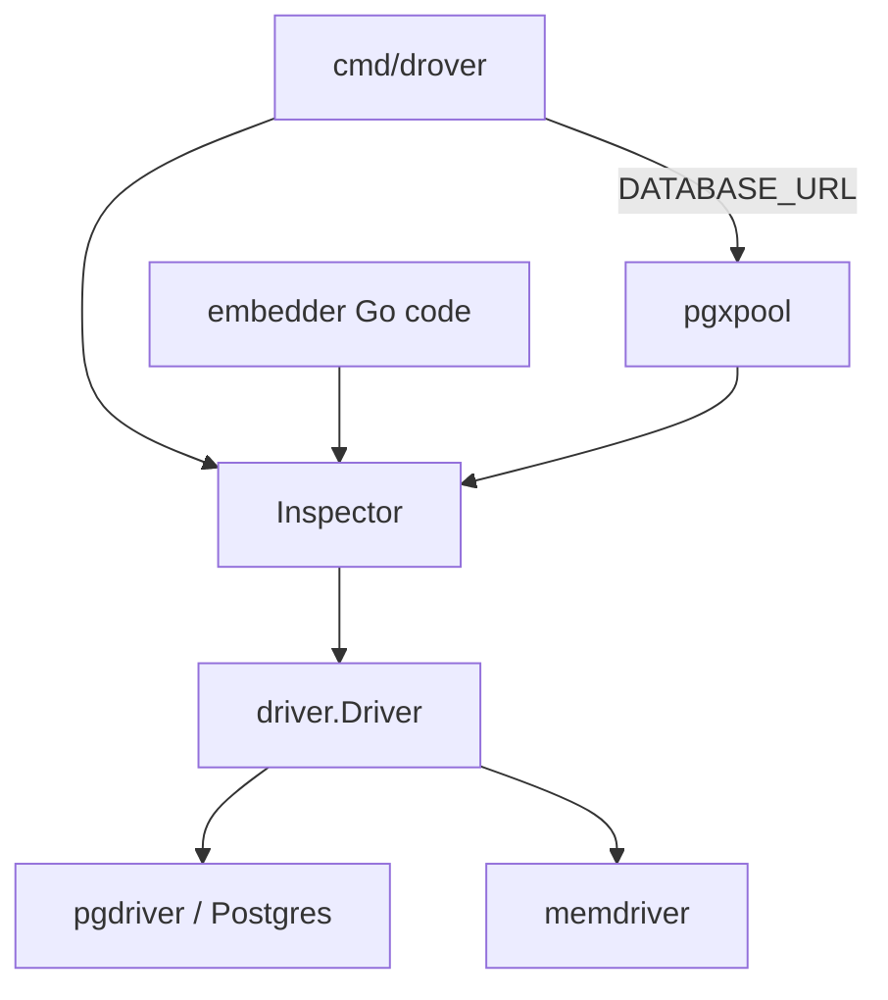

# CLI + Introspection Design

**Spec**: `.specs/features/cycle-f-cli-introspection/spec.md`
**Context**: `.specs/features/cycle-f-cli-introspection/context.md`
**Status**: Approved (auto-decided under the ship-cycle rule)

---

## Architecture Overview

Three layers, top to bottom:

1. **`cmd/drover`** — stdlib `flag` dispatcher: parse global `--database` / `--json`,
   route to subcommands, print human or JSON, map errors to exit codes.
2. **Exported `Inspector`** (root package) — operator API over the unexported driver.
   Constructed from `*pgxpool.Pool` via `NewInspector`; tests use `newInspector(drv)`.
3. **Driver extensions** — `ListJobs`, `GetJob`, `OperatorCancel`, `RedriveDead` on
   `driver.Driver`, implemented by `pgdriver` and `memdriver`. `Stats` and `Insert` already
   exist and are reused.



`Client` is untouched for operator actions. Workers keep AD-019 lease fences; operator
writes use separate state-conditioned SQL.

---

## Approach (chosen)

| Approach | Summary | Verdict |
| --- | --- | --- |
| **A. Inspector + driver methods + stdlib CLI** | As above | **Chosen** — matches ADR-0002/0004 and Cycle E's Stats precedent |
| B. CLI talks to Postgres via sqlc only | Skip Inspector and memdriver | Rejected — unit suite would need Docker for core behaviour |
| C. Methods on Client | No second type | Rejected — D-2; forces worker construction for ops |

---

## Code Reuse Analysis

| Component | Location | How to Use |
| --- | --- | --- |
| `Driver.Stats` | `internal/driver/driver.go` | `Inspector.Stats` is a thin map to public types |
| `Driver.Insert` | same | `Inspector.Enqueue` builds `InsertParams` (kind, queue, raw JSON args) |
| `GetJob` sqlc query | `queries.sql:85` | Already exists; expose via `Driver.GetJob` |
| Public `JobRow` / `JobState` | `client.go`, `job.go` | Return these from Inspector; map from `driver.JobRow` as Client already does |
| `ErrInvalidKind` | `errors.go` | Enqueue empty kind |
| `newClient(drv, cfg)` pattern | `client.go:222` | Mirror as `newInspector(drv)` |
| `testdb.NewDB` | `internal/testdb` | pgdriver + optional Inspector integration tests |
| `publishedDepthStates` / Stats shape | `stats.go`, `driver.Stats` | CLI `stats` output mirrors gauge semantics (AD-048) |
| pgxpool construction | `NewClient` | Same pool open path for CLI |

---

## Components

### 1. Driver interface additions (`internal/driver`)

```go
type ListJobsParams struct {
    Queue string    // empty = all queues
    State JobState  // empty = all states
    Limit int       // caller guarantees > 0
}

ListJobs(ctx context.Context, p ListJobsParams) ([]*JobRow, error)
GetJob(ctx context.Context, id int64) (*JobRow, error) // ErrNotFound
// OperatorCancel: available|scheduled|retryable|dead → cancelled
OperatorCancel(ctx context.Context, id int64) (*JobRow, error) // ErrNotFound | ErrInvalidTransition
// RedriveDead: dead → available, attempt=0, leased_until NULL, scheduled_at=now(), keep errors
RedriveDead(ctx context.Context, id int64) (*JobRow, error) // ErrNotFound | ErrInvalidTransition
```

No schema migration: all columns exist. New SQL in `queries.sql`; regenerate sqlc.

**Cancel SQL sketch:**
`UPDATE ... SET state='cancelled', finalized_at=now(), leased_until=NULL
 WHERE id=$1 AND state IN ('available','scheduled','retryable','dead')
 RETURNING *` — 0 rows → distinguish missing vs wrong state via GetJob.

**Redrive SQL sketch:**
`UPDATE ... SET state='available', attempt=0, leased_until=NULL, finalized_at=NULL,
 scheduled_at=now() WHERE id=$1 AND state='dead' RETURNING *`

### 2. Public Inspector (`inspector.go`)

```go
type Inspector struct { drv driver.Driver }

func NewInspector(pool *pgxpool.Pool) *Inspector
func newInspector(drv driver.Driver) *Inspector // tests

type ListJobsOpts struct {
    Queue string
    State JobState
    Limit int // ≤0 → 100
}

func (in *Inspector) Stats(ctx context.Context) (*QueueStats, error)
func (in *Inspector) ListJobs(ctx context.Context, opts *ListJobsOpts) ([]*JobRow, error)
func (in *Inspector) GetJob(ctx context.Context, id int64) (*JobRow, error)
func (in *Inspector) CancelJob(ctx context.Context, id int64) (*JobRow, error)
func (in *Inspector) RetryJob(ctx context.Context, id int64) (*JobRow, error)
func (in *Inspector) Enqueue(ctx context.Context, kind string, args json.RawMessage, opts *InsertOpts) (*JobRow, error)
```

Public errors: wrap/export `ErrNotFound`, `ErrInvalidTransition` (or package-level aliases
that `errors.Is` the driver sentinels — prefer exporting root-package sentinels that the
Inspector sets so callers never import `internal/driver`).

**Chosen error surface:** add `var ErrNotFound`, `var ErrInvalidTransition` on the root
package (or reuse names if already present — check; today they are driver-only). Map in
Inspector with `%w` so `errors.Is` works against root sentinels that wrap/equal driver ones.
Simplest durable approach: define root sentinels and have Inspector translate:

```go
if errors.Is(err, driver.ErrNotFound) { return nil, fmt.Errorf("…: %w", ErrNotFound) }
```

### 3. CLI (`cmd/drover`)

- `main.go` — dispatch, version var, usage
- `db.go` — resolve DSN, open pool, migrate? **No auto-migrate** (ASM-12); assume schema exists
- `format.go` — human vs JSON writers
- `cmd_stats.go`, `cmd_jobs.go`, `cmd_retry.go`, `cmd_cancel.go`, `cmd_enqueue.go`

Nested `jobs list`: after global flags, if `args[0]=="jobs" && args[1]=="list"`.

Exit codes: 0 success; 2 usage; 1 operational error (not found, invalid transition, DB).

### 4. GoReleaser

`.goreleaser.yaml` at repo root per research: builds `cmd/drover`, multi-OS/arch,
`CGO_ENABLED=0`, `-X main.version={{.Version}}`, archives, checksums. No brew/docker.

---

## Data Models

| Model | Role |
| --- | --- |
| `QueueStats` | Public view of `driver.Stats` (depths + oldest ages) |
| `ListJobsOpts` | Filter + limit |
| Existing `JobRow` | List/Get/Cancel/Retry/Enqueue return value |
| Existing `InsertOpts` | Queue (and ScheduledAt if we allow delay from CLI — **yes**, optional `--at` is out of scope; only Queue this cycle) |

---

## Error & Conflict Handling

| Case | Behaviour |
| --- | --- |
| Unknown id | `ErrNotFound` |
| Cancel wrong state / Retry non-dead | `ErrInvalidTransition` |
| Claim wins race (0 rows on UPDATE, Get shows running) | `ErrInvalidTransition` |
| Empty kind / bad JSON | validation error before driver call |
| DB down | surface error; CLI exit 1 |

---

## Risks & Concerns

| Risk | Mitigation |
| --- | --- |
| Operator UPDATE races with `FetchAvailable` | Single-statement state-conditioned UPDATE; 0 rows → re-read → precise error |
| Widening `Driver` further | Accepted (D-3); document methods as operator-only |
| CLI auto-migrate surprise | Explicitly do not migrate (ASM-12) |
| Unbounded list | Default and floor limit at 100 |
| JSON args injection into jsonb | Pass as bound parameter / `json.RawMessage` validated by `json.Valid` |
| `GetJob` already in sqlc but unused on interface | Promote carefully; keep `explain` path working |

---

## Implementation Notes

- No new migration.
- After SQL changes: `sqlc generate` and commit `internal/dbsqlc`.
- README: short "CLI" section with connection env and the five commands.
- Do not put task/AD IDs in commits.

---

## Requirement → Design Traceability

| ID | Design element |
| --- | --- |
| CLI-01 | `Inspector` + `NewInspector` / `newInspector` |
| CLI-02 | `Inspector.Stats` → `Driver.Stats` |
| CLI-03 | `ListJobs` / `GetJob` driver + Inspector |
| CLI-04 | `OperatorCancel` |
| CLI-05 | `RedriveDead` |
| CLI-06 | `Inspector.Enqueue` → `Insert` |
| CLI-07–10 | `cmd/drover` subcommands |
| CLI-11 | `.goreleaser.yaml` + version |
