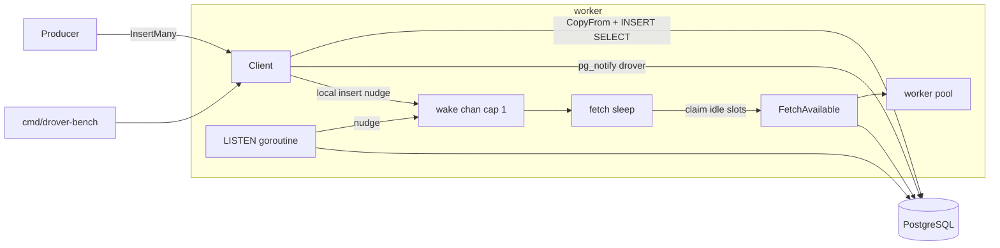

# Benchmark + Hardening Design

**Spec**: `.specs/features/cycle-g-benchmark-hardening/spec.md`
**Context**: `.specs/features/cycle-g-benchmark-hardening/context.md`
**Status**: Approved (auto-decided under the ship-cycle rule)

---

## Architecture Overview

Four additions around the existing client:

1. **Batch insert** — `InsertMany` / `InsertManyTx` on `Client`, `InsertMany` /
   `InsertManyTx` on `driver.Driver`. pgdriver stages rows with `CopyFrom` into a
   session-temp table, then `INSERT … SELECT … RETURNING` using the same
   `scheduled_at`/`state` CASE as `InsertJob` (AD-035). memdriver appends under
   its mutex, atomically after validation.
2. **Notify wake-up** — `Config.NotifyWakeup`. After a successful insert the
   client nudges a capacity-1 `wake` channel and, on pgdriver, emits one
   `pg_notify('drover','')` (inside the caller tx for `*Tx` methods). A LISTEN
   goroutine (pgdriver only, started from the runner when the flag is set)
   nudges the same channel. `runner.sleep` selects on `stopFetch`, `wake`, and
   the poll timer.
3. **`cmd/drover-bench`** — stdlib `flag` harness: enqueue-only throughput or
   insert-then-drain with no-op handlers. Prints methodology then numbers.
4. **README** — `## Benchmarks` filled from a real run; Planned API shows
   `InsertMany`; Examples compile-check new fields.



Claiming is unchanged: `FetchAvailable(..., remaining)` still equals idle
workers (AD-022). Polling remains the source of truth; notify only interrupts
sleep.

---

## Approach (chosen)

| Approach | Summary | Verdict |
| --- | --- | --- |
| **A. Public InsertMany via COPY+staging+RETURNING; opt-in NotifyWakeup over poll; drover-bench + README table** | As above | **Chosen** — matches the RFC row and ADR-0002 |
| B. COPY only inside the bench; no public batch API | Smaller library | Rejected — D-1 (c); RFC lists batch insert as a library feature |
| C. Always-on LISTEN + `pgx.Batch` instead of COPY | One wake path, simpler insert | Rejected — contradicts ADR-0002 and the RFC's COPY FROM |

---

## Code Reuse Analysis

| Component | Location | How to Use |
| --- | --- | --- |
| `insertParamsFor` / `InsertOpts` | `client.go:338–406` | Map each `InsertItem` through the existing helper before the driver call |
| `InsertJob` CASE expression | `internal/pgdriver/queries.sql:18–27` | Copy into `InsertJobsFromStaging` so dueness stays on the DB clock |
| `driver.InsertParams` | `internal/driver/driver.go:52` | Slice of these is the driver-level batch |
| `FetchAvailable` limit = idle slots | `pool.go:461–512` | Do not change |
| `runner.sleep` | `pool.go:565–574` | Add `wake` select arm; keep `stopFetch` winning vs the timer |
| `newClient(drv, cfg)` | `client.go:222` | New Config field + wake channel; memdriver tests stay Docker-free |
| `cmd/drover` flag style | `cmd/drover/globals.go` | Copy stdlib `flag` + exit-code conventions for the bench |
| `testdb.NewDB` | `internal/testdb` | pgdriver COPY + cross-client NOTIFY integration tests |
| `example_test.go` | root | New Example for `NotifyWakeup` / `InsertMany` (lesson L-009) |
| `ErrTxUnsupported` | `internal/driver/driver.go:28` | `memdriver.InsertManyTx` returns it, matching `InsertTx` |

`driver.Driver` is **not** widened with LISTEN: that needs a session-scoped
connection and is pg-specific. Optional unexported interfaces on the pgdriver
concrete type keep the unit suite on memdriver.

---

## Components

### 1. Public batch API (root package)

```go
type InsertItem struct {
    Args JobArgs
    Opts *InsertOpts // nil = defaults
}

func (c *Client) InsertMany(ctx context.Context, items []InsertItem) ([]*JobRow, error)
func (c *Client) InsertManyTx(ctx context.Context, tx pgx.Tx, items []InsertItem) ([]*JobRow, error)
```

- Empty/nil `items`: `return []*JobRow{}, nil` (or `nil, nil` — pick one and
  test it; prefer non-nil empty slice for range-safety).
- Validate **all** items via `insertParamsFor` first. A nil `Args` is treated
  as empty kind → `ErrInvalidKind`. Any failure inserts nothing.
- Then `c.drv.InsertMany` / `InsertManyTx`. Map rows with `rowFromDriver`.
- If `c.notifyWakeup` and the call succeeded and returned rows:
  - non-tx: `c.nudge()` then `c.notify(ctx)`
  - tx: `c.notifyTx(ctx, tx)` only (no local nudge: uncommitted rows are
    invisible; LISTEN fires at commit). Same-process `InsertTx` + worker
    therefore relies on self-NOTIFY, which requires the worker to be
    LISTENing — i.e. Postgres. memdriver has no `*Tx` path.

Single `Insert` / `InsertTx` gain the same notify/nudge behaviour; they do
not change their SQL.

### 2. Driver interface additions (`internal/driver`)

```go
InsertMany(ctx context.Context, batch []InsertParams) ([]*JobRow, error)
InsertManyTx(ctx context.Context, tx any, batch []InsertParams) ([]*JobRow, error)
```

Empty batch: empty result, nil error, no write. `InsertManyTx` on memdriver:
`ErrTxUnsupported`.

NOTIFY is **not** on this interface. pgdriver implements an unexported
optional surface the client type-asserts:

```go
type notifier interface {
    Notify(ctx context.Context) error
    NotifyTx(ctx context.Context, tx any) error
}

type wakeupListener interface {
    // Blocks until ctx is done. Signals wake (non-blocking, cap-1) each
    // time a notification arrives. Must reconnect on connection loss
    // rather than returning, unless ctx is done.
    ListenWakeups(ctx context.Context, wake chan struct{}) error
}
```

`ListenWakeups` returning an error at startup is logged by the runner;
the goroutine exits and poll continues. A later drop is handled inside
the method by reconnecting.

### 3. pgdriver COPY path

In one transaction (caller’s, or begun internally):

1. `CREATE TEMP TABLE IF NOT EXISTS drover_insert_batch (ord int, kind text, queue text, args jsonb, scheduled_at timestamptz) ON COMMIT DROP`
2. `TRUNCATE drover_insert_batch`
3. `CopyFrom` those five columns. Zero `ScheduledAt` → SQL NULL (coalesced
   to `now()` like `InsertJob`).
4. `INSERT INTO drover_jobs (kind, queue, args, scheduled_at, state) SELECT … ORDER BY ord RETURNING *`
   with the identical CASE as `InsertJob`.
5. Commit if the driver opened the tx.

Notify is a separate `SELECT pg_notify('drover', '')` issued by the client
after success, or `NotifyTx` on the caller tx.

**Trap:** two `InsertManyTx` in one caller tx — `IF NOT EXISTS` + `TRUNCATE`
avoids `duplicate_table`. `ON COMMIT DROP` still cleans up.

**Trap:** do not `LIKE drover_jobs` — that would copy `id`/`state` and fight
defaults.

sqlc query: `InsertJobsFromStaging :many`. Temp-table DDL and `CopyFrom`
stay as raw pgx in `pgdriver` (sqlc does not own COPY).

### 4. memdriver batch

Lock once. Validate already happened at the client, but still reject empty
kind. Append every row, assign ids, then unlock. A panic mid-loop must not
be possible after validation; if an append fails, roll back the in-memory
slice (copy-on-write or append to a snapshot). `InsertManyTx` →
`ErrTxUnsupported`.

### 5. Wake channel and sleep

`Client` (construction): `wake chan struct{}` with buffer 1, always
allocated (cheap). `nudge()` is a default-send:

```go
select {
case c.wake <- struct{}{}:
default:
}
```

`runner.sleep`:

```go
select {
case <-r.stopFetch:
    return false
case <-r.client.wake:
    return true
case <-timer.C:
    return true
}
```

The wake arm is harmless when the flag is false (nobody sends). Stop must
still win promptly — Cycle C already tests this; do not let a flooded wake
channel delay it (`stopFetch` is a close, always receivable).

LISTEN goroutine is one more `r.background` member, cancelled via
`fetchCtx`, so it dies when claiming stops (not after drain). Ops server
still shuts down last (AD-047). Heartbeat still outlives fetch (AD-018).

`Start` does **not** fail if LISTEN cannot be acquired.

### 6. `cmd/drover-bench`

Package `main` under `cmd/drover-bench/`. Flags:

| Flag | Default | Meaning |
| --- | --- | --- |
| `--database` | `$DATABASE_URL` | Postgres URL |
| `--mode` | `drain` | `enqueue` or `drain` |
| `--jobs` | `10000` | How many no-op jobs |
| `--batch` | `256` | `InsertMany` chunk size |
| `--concurrency` | `10` | Worker pool for drain; ignored for enqueue |
| `--queue` | `default` | Queue name |
| `--notify` | `false` | Sets `Config.NotifyWakeup` |

Flow: migrate → `InsertMany` loop → (drain: `Start`, wait for
`Inspector.Stats` / poll completed count until `jobs` completions, `Stop`).
No-op `Worker` returns nil. Print methodology to stdout, then a stable
key=value or column block the README can quote.

Do not add this binary to `.goreleaser.yaml`.

### 7. README + Examples

- New `## Benchmarks` after CLI (or before Roadmap): table + command +
  caveats. Numbers come from running the harness during this cycle.
- Planned API snippet: one `InsertMany` example.
- Roadmap line: Cycle G shipped.
- `ExampleConfig_notifyWakeup` and `ExampleInsertMany` (or one example
  covering both) in `example_test.go`.

---

## Data Models

No schema change. Staging table is session-temp, not a migration.

`InsertItem` is the only new exported type.

---

## Error Handling Strategy

| Error Scenario | Handling | User Impact |
| --- | --- | --- |
| Nil Args / empty kind / marshal in a batch | Fail before any write; `ErrInvalidKind` or wrapped marshal error | Batch not inserted |
| COPY / INSERT failure | Rollback the driver transaction; wrapped error | Zero rows from that call |
| `InsertManyTx` on memdriver | `ErrTxUnsupported` | Tests use InsertMany; Tx stays Postgres |
| LISTEN acquire / `LISTEN` SQL fails | Log error; poll continues; `Start` returns nil | Idle latency = poll interval |
| LISTEN connection drop | Log; reconnect with poll-interval backoff; pool keeps running | Transient poll-only |
| `NOTIFY` after insert fails | Log; rows are already committed; local `nudge` still runs | Cross-process wake missed this once |
| Bench missing DSN / bad flags | Exit 2, usage on stderr | Nothing inserted |

---

## Risks & Concerns

| Concern | Location | Impact | Mitigation |
| --- | --- | --- | --- |
| Prefetch temptation ("grab 100") | RFC wording vs AD-022 | Leased rows nobody runs | D-7: do not add FetchBatchSize |
| NOTIFY commit serialization | `pg_notify` on every insert when flag on | Producer throughput cliff | Default off; one notify per call not per row; document |
| Temp table name collision in one tx | Second `InsertManyTx` | Hard error | `IF NOT EXISTS` + `TRUNCATE` |
| Uncommitted InsertTx local nudge | fetch would see nothing / skip-locked | Wasted round | No local nudge on Tx path |
| goleak on LISTEN goroutine | `runner.start` | False leak or leaked conn | `fetchCtx` cancel + `background.Wait` |
| README numbers without a run | DOC-01 | Unverifiable claim | Task must run the harness (Docker) and paste real output |
| Statement-timeout vs COPY of huge batches | pgdriver | Partial? COPY is transactional | No artificial max in this cycle; bench default 256 |
| `WaitForNotification` vs pgbouncer | Config field | LISTEN never works | Document; Start still succeeds (WAKE-05) |

---

## Tech Decisions (project-level → STATE.md)

| Decision | Choice | Rationale |
| --- | --- | --- |
| Batch API | `[]InsertItem` + InsertMany(Tx) | D-1 |
| COPY+staging | temp table + CopyFrom + INSERT SELECT RETURNING | D-2 |
| Notify default | `NotifyWakeup` default false | D-3 |
| Notify emission | Client, coalesced, flag-gated, Tx-scoped | D-4 |
| Wake plumbing | cap-1 channel + optional LISTEN; not on Driver | D-5 |
| LISTEN vs Start | degrade to poll | D-6 |
| Claim size | unchanged idle-slot batch | D-7 |
| Bench | `cmd/drover-bench` enqueue+drain, README from a real run | D-8 |

Feature-local: temp table name `drover_insert_batch`; channel name `drover`;
bench defaults 10000/256/10.
