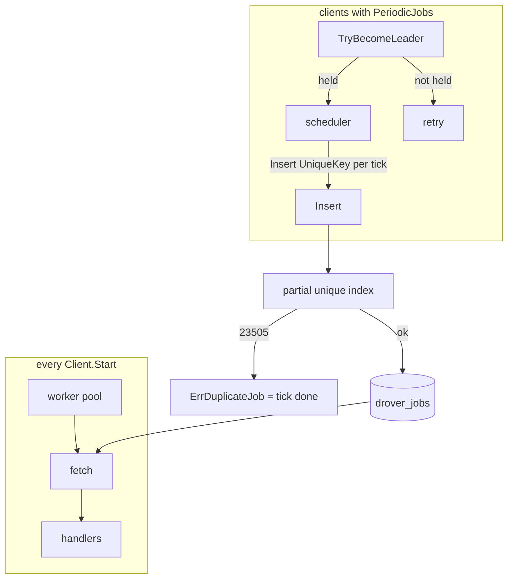

# Periodic Jobs + Unique Jobs Design

**Spec**: `.specs/features/cycle-h-periodic-jobs/spec.md`
**Context**: `.specs/features/cycle-h-periodic-jobs/context.md`
**Status**: Approved (auto-decided under the ship-cycle rule)

---

## Architecture Overview

Two layers, deliberately independent so unique jobs are useful without
cron, and so a lock split-brain cannot create duplicate ticks:

1. **Unique insert** — `InsertOpts.UniqueKey` stored as `drover_jobs.unique_key`.
   A partial unique index refuses a second non-terminal row of the same
   `(queue, kind, unique_key)`. Postgres raises `23505`; both adapters
   translate it to `ErrDuplicateJob`.
2. **Leader-elected scheduler** — clients with a non-empty
   `Config.PeriodicJobs` compete for a session advisory lock on a
   dedicated connection. The holder computes the next fire in-process
   and `Insert`s with `UniqueKey = id + "/" + fireRFC3339NanoUTC`. Duplicate
   is tick success.



Claiming, leases, retries, and shutdown of workers are unchanged.
The scheduler shares `fetchCtx` with the rescuer: when claiming stops,
enqueueing stops.

---

## Approach (chosen)

| Approach | Summary | Verdict |
| --- | --- | --- |
| **A. Public UniqueKey + stdlib cron + session advisory lock off Driver** | As above | **Chosen** — RFC row + AD-067–075 |
| B. Unique only as an internal periodic trick; robfig/cron; lock on Driver | Smaller public API, borrowed parser | Rejected — D-1/D-4/D-6 |
| C. Separate Scheduler binary | Clear duty | Rejected — extra command, not in the RFC |

---

## Code Reuse Analysis

| Component | Location | How to Use |
| --- | --- | --- |
| `InsertOpts` / `insertParamsFor` | `client.go:358`, `client.go:519` | Add `UniqueKey`; pass through `driver.InsertParams` |
| `InsertJob` CASE | `internal/pgdriver/queries.sql:17` | Add `unique_key` column; keep database-clock state |
| `insertBatchDDL` / `CopyFrom` | `internal/pgdriver/pgdriver.go:177` | Add `unique_key` to staging + COPY columns |
| `wakeupListener` | `client.go:455` | Precedent: pg-only session surface, not on `driver.Driver` |
| `runner.start` background set | `pool.go:132` | +1 goroutine when `len(PeriodicJobs) > 0` |
| `fetchCtx` | `pool.go` (rescuer/refresher) | Scheduler cancellation |
| `runner.sleep` Stop-vs-timer | `pool.go:603` | Same select pattern: stop must beat next-fire |
| `newClient` structural panics | `client.go:236` | Validate PeriodicJobs (AD-037) |
| `testdb.NewDB` | `internal/testdb` | Unique-index + two-client lock integration |
| `example_test.go` | root | Example naming UniqueKey + PeriodicJobs |
| `examples/email` | `examples/email/main.go` | One periodic job alongside the delayed digest |
| `ErrTxUnsupported` | `internal/driver/driver.go:28` | Unchanged |

`driver.Driver` is **not** widened with lock methods. Unique insert *does*
widen `InsertParams` and `JobRow` because both adapters persist the column.

---

## Components

### 1. Schema (migration 004)

```sql
ALTER TABLE drover_jobs ADD COLUMN unique_key text;

CREATE UNIQUE INDEX drover_jobs_unique_active_idx
  ON drover_jobs (queue, kind, unique_key)
  WHERE unique_key IS NOT NULL
    AND state IN ('available', 'scheduled', 'retryable', 'running');
```

Empty UniqueKey → SQL NULL, not `''`, so it does not occupy the index.

Also update `internal/pgdriver/sqlc_schema.sql` staging table:
`unique_key text`.

### 2. Driver insert path

`driver.InsertParams` and `driver.JobRow` gain `UniqueKey string`.

Postgres `InsertJob` / `InsertJobsFromStaging` write `unique_key`.
On unique_violation (`23505` whose constraint/index is the unique
active index), return a driver-level duplicate error that the client
wraps as `drover.ErrDuplicateJob`.

A unique-key collision *inside* one `InsertMany` batch is also a unique
violation (two rows would occupy the same index entry); the transaction
aborts and the client sees `ErrDuplicateJob` with zero rows persisted.

memdriver: under the existing mutex, scan non-terminal rows for a matching
`(queue, kind, unique_key)` before append; same for each item in
InsertMany (fail all if any collides with existing or with an earlier
item in the batch).

### 3. Public unique API (root package)

```go
var ErrDuplicateJob = errors.New("drover: job with this unique key already exists")

type InsertOpts struct {
    Queue, ScheduledAt // existing
    UniqueKey string
}

type JobRow struct {
    // existing fields…
    UniqueKey string
}
```

`insertParamsFor` copies UniqueKey. No trim: only `""` means not unique.

### 4. Cron parser (`internal/cron`)

```go
package cron

func Parse(spec string) (Schedule, error)

type Schedule interface {
    Next(t time.Time) time.Time // strictly after t
}

func ParseIn(spec string, loc *time.Location) (Schedule, error)
```

- 5-field: `min hour dom month dow` with `*`, lists `1,2`, ranges `1-5`,
  steps `*/5` and `1-10/2`. Fields are numeric. `dow` 0 and 7 = Sunday.
- `@every 30s` — `time.ParseDuration`; must be > 0. `Next(t)` is
  `t.UTC().Truncate(d).Add(d)` (repeat until `> t`).
- `loc` nil = UTC. Cron fields use `t.In(loc)`.
- Parse errors; never panic.

Fuzz: `FuzzParse` with a seed corpus of valid specs.

### 5. Periodic registration

```go
type PeriodicJob struct {
    ID       string
    Cron     string
    Args     JobArgs
    Opts     *InsertOpts // UniqueKey overwritten at enqueue
    Location *time.Location // nil = UTC
}
```

`Config.PeriodicJobs []PeriodicJob`.

`newClient` panics when any job has empty ID, duplicate ID, nil Args,
empty Args.Kind(), or Cron that fails `cron.Parse`. Parsed schedules
are stored on the Client.

### 6. Leader lock (`leaderLocker`, pgdriver only)

```go
type leaderLocker interface {
    TryBecomeLeader(ctx context.Context) (bool, error)
    ReleaseLeader()
}
```

pgdriver: dedicated `Acquire`d conn (never returned to the pool while
held). `SELECT pg_try_advisory_lock($1)` with documented

```text
advisoryLockPeriodic int64 = 0x64726f7665720001 // "drover" << 8 | 1
```

If the conn dies, the session lock is gone; `TryBecomeLeader` acquires
a new conn. `ReleaseLeader` closes the conn.

memdriver does not implement the interface: the scheduler treats a
missing locker as "always leader".

### 7. Scheduler goroutine

Launched from `runner.start` only when `len(PeriodicJobs) > 0`.
Shares `fetchCtx`. Counted in `background` WaitGroup.

Loop (sketch of behaviour, not the required structure):

- Until `fetchCtx` is done: try to become leader (no-op success on memdriver).
- If not leader: wait `PollInterval` or `fetchCtx`, retry. Log acquire errors.
- If leader: compute the soonest `Next(now)` across jobs; sleep until
  then *or* `fetchCtx`; on wake, for each job whose Next(lastNow) is
  `<= now`, Insert with UniqueKey as AD-072, ScheduledAt = fire time,
  UniqueKey on opts overwritten. `ErrDuplicateJob` → continue.
- On `fetchCtx` done: `ReleaseLeader()`, return. Sleep must not wait
  out the timer (select on ctx).

First fire strictly after leadership: on becoming leader, watermark
each job at `time.Now()` and take `Next` of that, never `Insert` for a
fire from before the lock was held. Late ticks while still leader still
catch up. `Next` returning zero is treated as no next fire.

Logging: INFO on becoming / losing leader; ERROR on lock acquire
failure; DEBUG or INFO on skip-duplicate.

### 8. Docs / example

README Planned API shows UniqueKey and PeriodicJobs. Roadmap blurb
moves periodic jobs into the shipped clause. `example_test.go` names
the fields. `examples/email` registers one `@every` or five-minute
cron kind so the example still compiles against the new Config.

---

## Data Models

### drover_jobs.unique_key

`text NULL`. Indexed only when non-NULL and state is non-terminal.

### PeriodicJob identity

`ID` is the uniqueness prefix, not the job kind. Two periodic jobs may
share a kind if IDs differ (unusual; allowed). Kind still comes from
`Args.Kind()`.

---

## Error Handling Strategy

| Error Scenario | Handling | User Impact |
| --- | --- | --- |
| Unique conflict | `ErrDuplicateJob`; no row | Producer retries are no-ops |
| InsertMany unique conflict | Whole batch rolls back | Same as marshal failure |
| Bad cron / empty periodic ID | Panic at `newClient` | Programmer error, like nil middleware |
| Lock conn failure | Log ERROR; retry; Start succeeds | Ticks pause until a leader exists |
| Duplicate periodic tick | Scheduler continues | No extra row |
| Stop during long sleep | ctx wins; ReleaseLeader | goleak clean |

---

## Risks & Concerns

| Concern | Location | Impact | Mitigation |
| --- | --- | --- | --- |
| Session lock on a pooled connection would leak or hold across checkouts | `wakeupListener` / LISTEN path | Split-brain or stuck lock | Dedicated conn, same as LISTEN; never `Release` back to pool while locked |
| `CREATE TEMP TABLE IF NOT EXISTS` would keep an old staging shape | `pgdriver.go:177` | COPY column mismatch after adding unique_key | New DDL includes unique_key; ON COMMIT DROP so a transaction never mixes shapes |
| InsertMany intra-batch duplicate | staging INSERT | Unique violation | Fail the batch (AD-068); memdriver checks pairwise |
| Scheduler sleep ignores Stop | new goroutine | goleak / hung Stop | select on fetchCtx; test with a long next-fire and upper-bound elapsed (L-004) |
| Unique index vs COPY | InsertJobsFromStaging | 23505 mid-batch | Transaction aborts; client maps to ErrDuplicateJob |
| DST skipped hour | `internal/cron` | Next() could loop or skip | Document UTC default; Next iterates calendar minutes in loc and must terminate (cap scan or field-arithmetic). Tests: a spring-forward instant |
| Two InsertManyTx in one tx | existing reuse of temp table | New column must exist on first CREATE | First CREATE in the tx uses the new DDL |

---

## Tech Decisions (project-level → STATE.md)

Mirrored as AD-067–AD-076. Feature-local: lock int64 value, package
name `internal/cron`, 23505 translation vs ON CONFLICT (either is fine
if the client-visible error is `ErrDuplicateJob`).
