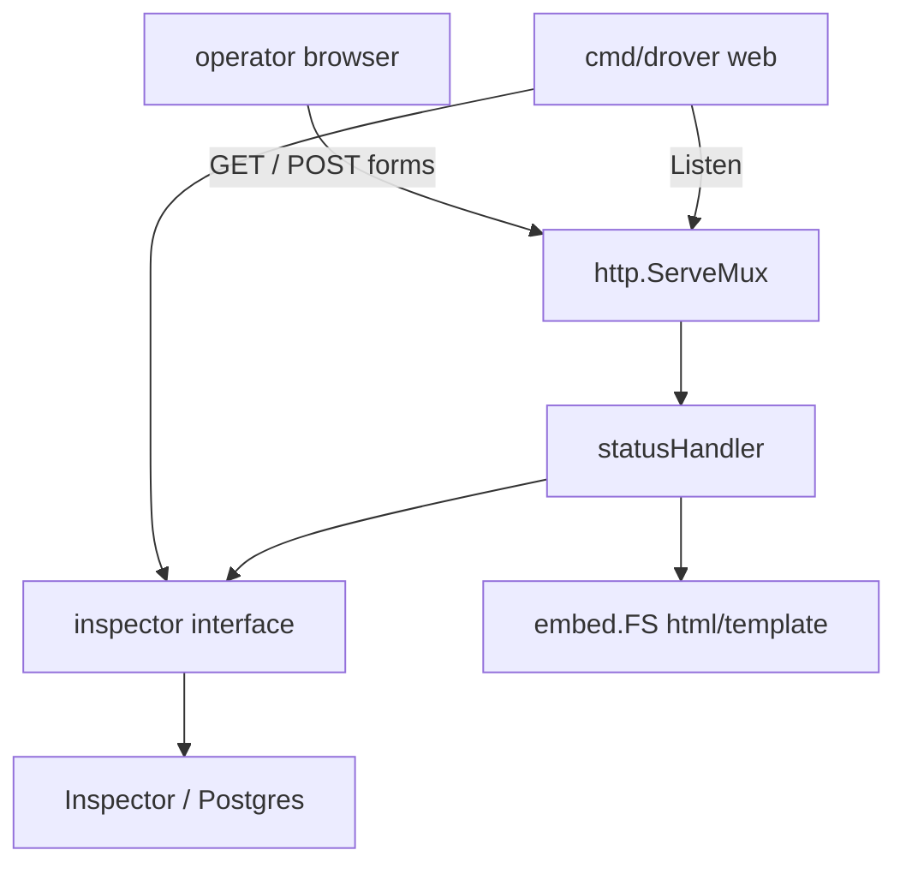

# Operator Status Page Design

**Spec**: `.specs/features/cycle-i-status-page/spec.md`
**Context**: `.specs/features/cycle-i-status-page/context.md`
**Status**: Approved (auto-decided under the ship-cycle rule)

---

## Architecture Overview

`drover web` is a long-running CLI command. It opens an `Inspector` the same
way `stats`/`retry` do, then serves stdlib `http.Server` until the process
context ends.



No new driver methods. No library HTML. No ops-port coupling.

---

## Approach (chosen)

| Approach | Summary | Verdict |
| --- | --- | --- |
| **A. CLI handler + embed.FS + Inspector** | `statusHandler` behind `httptest`; `runWeb` binds and shuts down | **Chosen** — D-1 |
| B. Exported library handler | Root package grows templates | Rejected — D-1(b) |
| C. HTML on the worker ops mux | Mutations on the metrics port | Rejected — D-1(c) |

---

## Code Reuse Analysis

| Component | Location | How to Use |
| --- | --- | --- |
| `inspector` interface | `cmd/drover/inspector.go` | Stats, ListJobs, CancelJob, RetryJob — already enough |
| `fakeInspector` | `cmd/drover/fake_inspector_test.go` | Handler tests |
| `withInspector` / DSN | `cmd/drover/main.go`, `globals.go` | Same open path; web holds the process until ctx done |
| `parseJobID` | `cmd/drover/format.go` | Path `{id}` |
| `ErrNotFound` / `ErrInvalidTransition` | `errors.go` | Flash codes via `errors.Is` |
| `ListJobsOpts` limits | `inspector.go` | 100 default, 1000 max — handler validates before call |
| `JobState` constants | `job.go` | Button visibility + `state` query enum |
| `cancellable` semantics | AD-052 / memdriver `cancellable` | Mirror in the template: available/scheduled/retryable/dead |
| Ops `http.Server` Shutdown | `ops.go` | Same Shutdown-then-join pattern; do not copy metrics |

**Concerns flagged**

| Concern | Mitigation |
| --- | --- |
| `run()` uses `context.Background()` forever | `runWeb` takes `ctx`; `run` installs `signal.NotifyContext` only on `web` so other commands stay unchanged |
| Global `-h` swallows subcommand help | Existing CLI behaviour; `web` flags still parse inside `runWeb` when not peeled as global help |
| XSS via Args/Errors/flash | `html/template` default escaping; flash is a code→constant map; never `template.HTML` for job fields |
| Localhost CSRF | Origin/Referer same-host (D-3) |
| `--json` peeled before the subcommand | Check `cfg.json` in the `web` branch of `run` |
| ListJobs with empty state vs default dead | Handler applies default before calling Inspector so tests can assert `listOpts.State` |

---

## Components

### 1. `webConfig` + flag parse (`cmd/drover/cmd_web.go`)

```go
type webConfig struct {
    Listen  string        // default 127.0.0.1:7180
    Refresh time.Duration // default 5s; 0 disables
}
```

`--refresh` parsed as `time.Duration`. Reject `0 < refresh < 1s`. Unknown flags → exit 2.

### 2. `statusHandler` (`cmd/drover/web.go`)

Fields: `inspector`, `refresh time.Duration`, `tmpl *template.Template`.

Routes on a `http.ServeMux`:

| Method + path | Behaviour |
| --- | --- |
| `GET /` | Stats + ListJobs; render `page.html` |
| `POST /jobs/{id}/retry` | CSRF → RetryJob → 303 |
| `POST /jobs/{id}/cancel` | CSRF → CancelJob → 303 |

Register a not-found handler so unmatched paths are 404 HTML, not the Go default.
Mutation paths: only POST is registered, so GET is 405 from ServeMux.

**GET /** query:**

| Param | Meaning |
| --- | --- |
| `queue` | passed through (empty = all queues) |
| `state` | omitted → `dead`; `all` → empty filter; else must be a known `JobState` |
| `limit` | omitted → 100; must be 1..1000 |
| `notice`, `error`, `id` | flash only; not passed to ListJobs |

**page data** (illustrative):

```go
type pageData struct {
    Depths  []drover.QueueDepth
    Oldest  []drover.QueueAge
    Jobs    []jobView
    Filters filterView // queue, state shown in form, limit
    Refresh time.Duration
    RefreshURL string // filters, no flash
    Flash   string    // canned, empty if none
    FlashKind string  // "notice" or "error"
}
type jobView struct {
    Row           *drover.JobRow
    CanRetry      bool
    CanCancel     bool
}
```

`CanRetry` iff `State == StateDead`. `CanCancel` iff available/scheduled/retryable/dead.

**PRG Location** builds `/` with `url.Values` from the POST form's hidden filter
fields plus flash codes.

**CSRF** (`sameOrigin(r)`): if `Origin` is set, parse and compare `Host` to
`r.Host`; else parse `Referer` the same way; else false. Do not honour
`X-Forwarded-*`.

**Headers on HTML responses:**
`Content-Type: text/html; charset=utf-8`
`X-Content-Type-Options: nosniff`
`Content-Security-Policy: default-src 'none'; style-src 'unsafe-inline'; form-action 'self'; frame-ancestors 'none'; base-uri 'none'`

### 3. Template (`cmd/drover/webui/page.html` + `go:embed`)

One file, inline CSS. Operator ledger: warm paper background, ink text,
tabular numbers, a rust accent for `dead` — not a purple SaaS dashboard.

Sections: title + bind-agnostic heading "drover", flash banner, stats tables
(depth, oldest age), GET filter form (`state` select includes `all` and each
`JobState`), jobs table with kind/queue/state/attempt/scheduled/error snippet
and forms.

Meta refresh (when `Refresh > 0`):
`<meta http-equiv="refresh" content="{{.RefreshSeconds}};url={{.RefreshURL}}">`

Parse templates once at handler construction (`template.Must`).

### 4. `runWeb` (`cmd/drover/cmd_web.go`)

1. Parse flags → `webConfig`.
2. `net.Listen("tcp", cfg.Listen)`.
3. Print `http://<addr>/` to stdout (`ln.Addr()` so `:0` tests work).
4. `http.Server{Handler: mux, ReadHeaderTimeout: 5s}`.
5. Serve in a goroutine; wait on `ctx.Done()` or `Serve` error.
6. `Shutdown` with a short bounded context (e.g. 5s); return 0 on clean
   cancel, 1 on serve/bind error.

`run()` `web` branch: refuse `cfg.json`; `signal.NotifyContext` for
`os.Interrupt` and `syscall.SIGTERM`; `withInspector` then `runWeb`.

### 5. Docs

README CLI table + a short "this is not a dashboard" paragraph (loopback,
CSRF, Inspector-backed). ADR-0006 records the scope decision (RQ05).

---

## Data Models

No new persistence. Flash codes:

| Code | Banner (constant) |
| --- | --- |
| `notice=retried` | `redrove job {id}` |
| `notice=cancelled` | `cancelled job {id}` |
| `error=not_found` | `job {id} not found` |
| `error=invalid_transition` | `job {id} refused the transition` |
| other | omit banner |

---

## API / CLI

```
drover web [--listen 127.0.0.1:7180] [--refresh 5s]
```

`--database` / `DATABASE_URL` unchanged. `--json` → exit 2.

---

## Security Considerations

- Loopback default; non-loopback is operator-opt-in exposure.
- POST + same-origin Origin/Referer.
- CSP forbids scripts.
- `html/template` escaping for job payloads.
- No secrets in HTML (DSN never rendered).

---

## Performance Considerations

One `Stats` + one `ListJobs` per GET / per refresh. Cap 1000 rows. No extra
indexes (Cycle F list query). `--refresh` minimum 1s when enabled.

---

## Testing Strategy

| Layer | How |
| --- | --- |
| Handler | `httptest` + `fakeInspector`, `t.Parallel` |
| CSRF / methods / 400s | table-driven |
| Escape | job Args `<script>` appears escaped in body |
| Flags / `--json` / missing DSN | `run()` |
| Listen + shutdown | `runWeb` with `127.0.0.1:0`, cancel ctx, goleak |
| Integration | not required — Inspector already has pgdriver coverage |

No Docker for this cycle's new tests.

---

## Risks & Concerns

| Risk | Mitigation |
| --- | --- |
| Scope creep into a dashboard | Out of Scope table; one template; Verifier checks no `.js` served |
| CSRF missed in tests | Discrimination sensor: POST without Origin/Referer must not call Inspector |
| Flash XSS | Codes only; tests with `error=<script>` produce no raw tag |
| Shutdown hang | `ReadHeaderTimeout`; `Shutdown` budget; goleak |
| Default-dead surprising vs CLI | README + filter form `all` |

---

## Tech Decisions (feature-local)

| Decision | Choice | Reason |
| --- | --- | --- |
| CSS | Inline in `page.html` | One document; CSP `style-src 'unsafe-inline'` |
| Port 7180 | Unprivileged, unlikely vs 8080/9090 | Documented default |
| `state=all` | Explicit unfiltered | Distinguishes omit (dead) from empty filter |
| `ReadHeaderTimeout` 5s | Slowloris hygiene | Cheap, stdlib-recommended |

Project-level decisions: AD-077–AD-083 in `STATE.md`.

---

## Open Questions

None — spec ASM table and D-1–D-7 close them.
