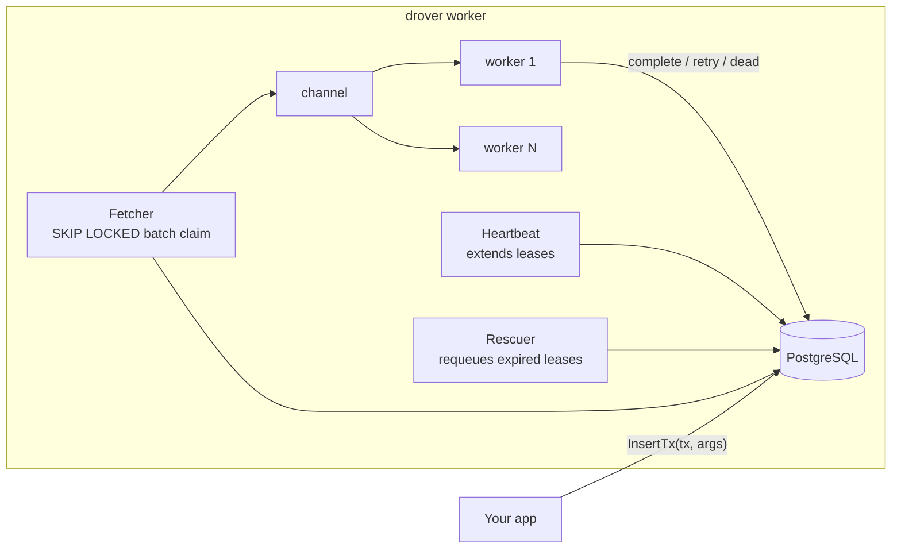

# drover

A PostgreSQL-backed task queue for Go, built from first principles — small enough to fully audit, honest about its delivery semantics, and documented down to every trade-off.

> **Status**: pre-v0.1, under active development. The architecture is settled ([ADRs](docs/adr/)), the roadmap is public ([RFC-0001](docs/rfc/0001-drover-roadmap.md)), and cycles ship as reviewable PRs.

## Why another queue?

Because the reasoning is the product. Established Go queues are excellent — [River](https://github.com/riverqueue/river) for Postgres-native semantics, [Asynq](https://github.com/hibiken/asynq) for observability — but their cores are large. Drover implements River-grade semantics (transactional enqueue, `FOR UPDATE SKIP LOCKED` claims, lease-based crash recovery, dead-letter retention) in a deliberately small codebase where every mechanism is explainable and provable, with each design decision recorded against the alternatives in [docs/adr/](docs/adr/) and grounded in [published research](docs/research/).

## Design at a glance



- **Transactional enqueue** — jobs insert inside your own transaction; no ghost jobs, no outbox needed ([ADR-0002](docs/adr/0002-postgres-only-backend-behind-narrow-storage-interface.md)). `InsertMany` / `InsertManyTx` flush a batch in one write (Postgres via `COPY FROM`).
- **At-least-once, stated plainly** — lease + heartbeat + rescuer; every duplicate source is named and bounded; handlers are idempotent by contract ([ADR-0003](docs/adr/0003-at-least-once-delivery-lease-heartbeat-rescuer.md)).
- **A real worker pool** — a fixed, configurable number of goroutines claim and run jobs concurrently over a channel, and `Stop` drains in-flight work within a caller-supplied budget instead of leaving shutdown to lease expiry. Each fetch round claims at most as many jobs as there are idle workers — never a prefetch buffer of leased rows nobody is running. `Config.NotifyWakeup` (off by default) can interrupt the poll wait via `LISTEN`/`NOTIFY`; polling stays the source of truth, and the flag needs session pooling (not PgBouncer transaction pooling).
- **Composable middleware** — a `func(Handler) Handler` chain wraps every job, whatever its kind; the built-in `Timeout` bounds a handler's context and `Logging` reports each execution, and both compose with middleware you write yourself ([ADR-0004](docs/adr/0004-single-module-root-package-layout-and-toolchain.md)).
- **Scheduled, prioritized queues** — `InsertOpts` delays a job to a future time and routes it to a named queue; queues are served from one shared worker pool by configurable weight, so a low-priority queue is slower, never starved ([ADR-0003](docs/adr/0003-at-least-once-delivery-lease-heartbeat-rescuer.md)).
- **Typed jobs** — `JobArgs` + `Worker[T]` generics, no `[]byte` payloads, no reflection.
- **Stdlib-first** — pgx + sqlc and the standard library; the dependency list stays short enough to read ([ADR-0004](docs/adr/0004-single-module-root-package-layout-and-toolchain.md)).

## Planned API (v0.1 target)

```go
type SendEmail struct {
    To, Template string
}

func (SendEmail) Kind() string { return "send_email" }

// Worker
drover.Register(workers, &EmailWorker{}) // implements drover.Worker[SendEmail]

// Concurrency sizes the worker pool; it defaults to 10. A running job
// holds no connection, so it need not match the database pool's size.
// Queues share that one pool by weight; Middleware wraps every job,
// Logging installed outermost ahead of whatever you add.
client, err := drover.NewClient(pool, drover.Config{
    Workers:      workers,
    Concurrency:  8,
    Queues:       map[string]int{"default": 1, "bulk": 9},
    Middleware:   []drover.Middleware{drover.Timeout(30 * time.Second)},
    NotifyWakeup: false, // opt-in LISTEN/NOTIFY; needs session pooling
})

// Enqueue atomically with your own writes
_, err = client.InsertTx(ctx, tx, SendEmail{To: user.Email, Template: "welcome"}, nil)

// Or delay a job and route it to a named queue; nil opts mean the
// "default" queue, runnable now.
_, err = client.Insert(ctx, SendEmail{To: user.Email, Template: "reminder"}, &drover.InsertOpts{
    Queue:       "bulk",
    ScheduledAt: time.Now().Add(24 * time.Hour),
})

// Flush many jobs in one write. Postgres uses COPY FROM; each item may
// name its own queue and schedule.
_, err = client.InsertMany(ctx, []drover.InsertItem{
    {Args: SendEmail{To: user.Email, Template: "welcome"}},
    {Args: SendEmail{To: user.Email, Template: "digest"}, Opts: &drover.InsertOpts{Queue: "bulk"}},
})

// Start returns once the pool is running. Stop stops claiming, drains
// in-flight jobs within the given budget, and returns nil once every
// one of them has recorded its outcome — or an error naming how many
// did not finish and were returned to the queue instead.
err = client.Start(ctx)
err = client.Stop(shutdownCtx)
```

A full runnable version of this, including the retry path, a custom middleware, and shutdown on SIGINT, lives in [`examples/email`](examples/email).

## Observability

Drover exposes Prometheus metrics on a dedicated ops port, separate from anything your application serves. Per-execution counters and histograms are recorded from the middleware chain; queue depth and oldest-job age are refreshed from the database on an interval, so scrape rate never multiplies database load ([ADR-0005](docs/adr/0005-prometheus-observability-via-ops-port-and-background-gauge-refresh.md)).

```go
client, err := drover.NewClient(pool, drover.Config{
    Workers:         workers,
    Concurrency:     8,
    Queues:          map[string]int{"default": 1, "bulk": 9},
    OpsAddr:         "127.0.0.1:9090", // /metrics, /healthz, /readyz
    StatsInterval:   15 * time.Second, // how often depth/age gauges refresh
    MetricsRegistry: prometheus.NewRegistry(),
})
```

Leave `OpsAddr` empty to record metrics without serving them — pass `MetricsRegistry` to your own `/metrics` handler instead. Bind the ops port to a private interface; TLS and authentication are deployment concerns.

### Ops endpoints

| Path | Meaning |
| --- | --- |
| `GET /metrics` | Prometheus text format from this client's registry |
| `GET /healthz` | Process is alive — always `200` |
| `GET /readyz` | Worker is started and the last gauge refresh succeeded within twice `StatsInterval`; otherwise `503` with a reason. Removes the worker from rotation on database loss without restarting the process. |

### Metrics

| Name | Type | Labels | Meaning |
| --- | --- | --- | --- |
| `drover_jobs_completed_total` | Counter | `queue` | Executions that returned no error. |
| `drover_jobs_failed_total` | Counter | `queue` | Executions that returned an error, including recovered panics. Counts **attempts**, not jobs that reached `dead` — a job that fails four times and succeeds on the fifth increments this four times. Use `drover_queue_depth{state="dead"}` for permanent failures. |
| `drover_job_duration_seconds` | Histogram | `queue` | Wall-clock time one execution took, successful or not. Buckets span 5ms to 10 minutes. |
| `drover_jobs_executing` | Gauge | — | Executions currently inside the middleware chain. |
| `drover_pool_concurrency` | Gauge | — | Configured worker count; compare to `drover_jobs_executing` for saturation. |
| `drover_queue_depth` | Gauge | `queue`, `state` | Jobs held in one state on one queue. States: `available`, `scheduled`, `retryable`, `running`, `dead`. `completed` and `cancelled` are deliberately absent — those rows accumulate forever, and counting them would make this gauge's cost grow with history instead of backlog. |
| `drover_oldest_job_age_seconds` | Gauge | `queue` | Age in seconds of the oldest job claimable *now* (same predicate the fetch loop uses). `0` when no job is waiting — a configured-but-empty queue publishes zero, not a missing series. |

### Alerting

Recommended primary alert — a queue with work that is not moving:

```promql
max by (queue) (max_over_time(drover_oldest_job_age_seconds[5m])) > 300
```

`drover_oldest_job_age_seconds` is the primary alerting metric because it detects a stuck queue regardless of cause: workers dead, fetch broken, database slow, or handlers hanging. Counters tell you jobs failed; depth by state tells you *where* they are; oldest age tells you work is waiting longer than it should. Page on five minutes for most workloads; tune the threshold to your SLA.

Secondary signals: `drover_queue_depth{state="dead"}` for permanent failure accumulation; `drover_jobs_executing / drover_pool_concurrency` near 1.0 for saturation.

## CLI

The `drover` binary is the operator surface for a live queue. Point it at Postgres with `--database` or `$DATABASE_URL` (the flag wins). The schema must already exist — the CLI does not run migrations. Add `--json` for machine-readable output on any command.

```
drover [--database URL] [--json] <command>
```

| Command | What it does |
| --- | --- |
| `stats` | Per-queue depth and oldest-claimable age |
| `jobs list` | List jobs; optional `--queue`, `--state`, `--limit` (default 100, maximum 1000) |
| `retry <id>` | Redrive a `dead` job to `available` (attempt reset; prior errors kept) |
| `cancel <id>` | Cancel a waiting or dead job (`running` / terminal states are refused) |
| `enqueue` | Insert a job: `--kind` required; optional `--queue`, `--args` (JSON, default `{}`) |
| `version` / `--version` | Print the embedded version (`dev` for local builds) |

Library callers that need the same reads and operator writes without spawning the binary use `drover.NewInspector(pool)` — `Stats`, `ListJobs`, `GetJob`, `Enqueue`, `CancelJob`, and `RetryJob` on an `Inspector`. It is not a `Client`: there is no worker pool and no `Start`/`Stop`.

### Releasing the binary

`.goreleaser.yaml` builds `cmd/drover` for linux, darwin, and windows on amd64 and arm64 with `CGO_ENABLED=0`, injects the tag via `-X main.version={{.Version}}`, and publishes archives plus `checksums.txt` (no Homebrew tap or Docker image). Cut a release from a version tag:

```
git tag v0.1.0
git push origin v0.1.0
goreleaser release --clean
```

Validate the config locally with `goreleaser check`. Snapshot builds without publishing: `goreleaser release --snapshot --clean`.

## Benchmarks

Numbers from one run of `cmd/drover-bench` on 2026-08-15. They are not a promise: they describe no-op handlers on a single node. Re-run the harness on your hardware before comparing.

**Machine**: WSL2, Linux 6.6 (`GOOS=linux`, `GOARCH=amd64`), Intel Core 7 240H (16 logical CPUs), Go 1.26.2. **Postgres**: 16.14 in Docker (`postgres:16-alpine`) on the same host. **Workload**: 10,000 no-op jobs, `InsertMany` batch 256, drain concurrency 10, `NotifyWakeup` off, queue `default`.

| Mode | jobs/sec | p50 | p95 | p99 |
| --- | ---: | ---: | ---: | ---: |
| enqueue (`InsertMany` only) | 16,230 | — | — | — |
| drain (Start until last completion) | 704 | 8.19s | 13.74s | 14.14s |

Drain percentiles are **enqueue-to-completion**, including time spent waiting for one of 10 workers — not handler runtime. Enqueue jobs/sec is the COPY FROM insert path alone. Drain jobs/sec starts after insert has finished.

Reproduce:

```
go run ./cmd/drover-bench --database "$DATABASE_URL" --mode enqueue --jobs 10000 --batch 256
go run ./cmd/drover-bench --database "$DATABASE_URL" --mode drain --jobs 10000 --batch 256 --concurrency 10
```

Raw harness output from the published run:

```
# enqueue
jobs/sec=16229.96
# drain
jobs/sec=703.66
p50=8.194814695s
p95=13.744624029s
p99=14.144354657s
```

`drover-bench` is a measurement harness, not a released operator tool — it is not part of the GoReleaser artifacts.

## Roadmap

v0.1.0 = cycles A–G of [RFC-0001](docs/rfc/0001-drover-roadmap.md): walking skeleton → retries/DLQ/rescue → worker pools + graceful shutdown → middleware + scheduled jobs → Prometheus observability → CLI + introspection → **benchmarks with published methodology**. Then: periodic jobs via advisory-lock leader election, and an optional server-rendered status page.

## Documentation

- [Architecture Decision Records](docs/adr/) — what was decided and why, including [observability (ADR-0005)](docs/adr/0005-prometheus-observability-via-ops-port-and-background-gauge-refresh.md)
- [RFC-0001 roadmap](docs/rfc/0001-drover-roadmap.md) — what ships when
- [Research](docs/research/) — the evidence behind the decisions (existing-system survey, storage mechanics, delivery semantics, conventions, scope)

## License

MIT
