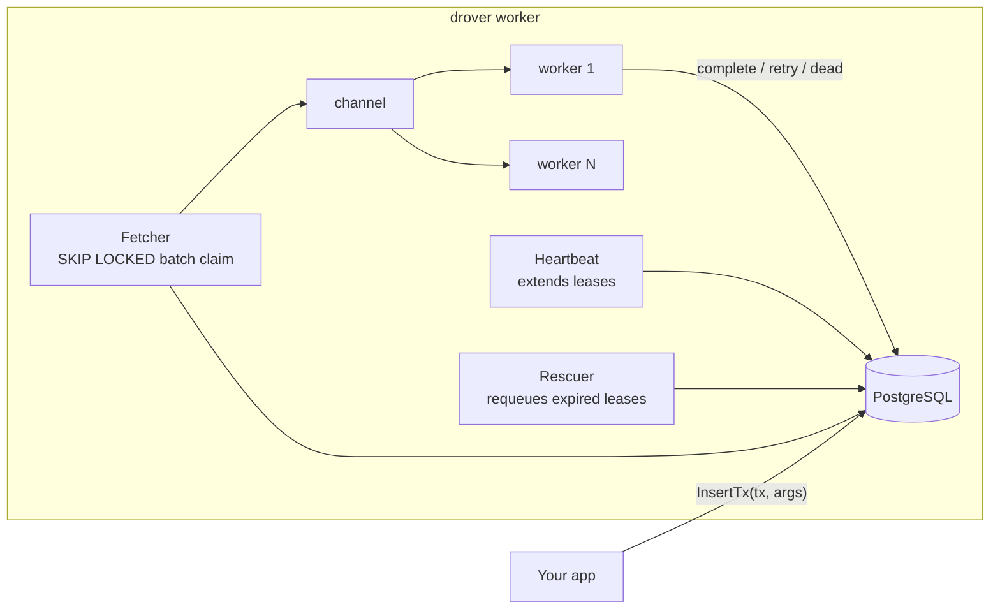

# drover

A PostgreSQL-backed task queue for Go, built from first principles — small enough to fully audit, honest about its delivery semantics, and documented down to every trade-off.

> **Status**: pre-v0.1, under active development. The architecture is settled ([ADRs](docs/adr/)), the roadmap is public ([RFC-0001](docs/rfc/0001-drover-roadmap.md)), and cycles ship as reviewable PRs.

## Why another queue?

Because the reasoning is the product. Established Go queues are excellent — [River](https://github.com/riverqueue/river) for Postgres-native semantics, [Asynq](https://github.com/hibiken/asynq) for observability — but their cores are large. Drover implements River-grade semantics (transactional enqueue, `FOR UPDATE SKIP LOCKED` claims, lease-based crash recovery, dead-letter retention) in a deliberately small codebase where every mechanism is explainable and provable, with each design decision recorded against the alternatives in [docs/adr/](docs/adr/) and grounded in [published research](docs/research/).

## Design at a glance



- **Transactional enqueue** — jobs insert inside your own transaction; no ghost jobs, no outbox needed ([ADR-0002](docs/adr/0002-postgres-only-backend-behind-narrow-storage-interface.md)).
- **At-least-once, stated plainly** — lease + heartbeat + rescuer; every duplicate source is named and bounded; handlers are idempotent by contract ([ADR-0003](docs/adr/0003-at-least-once-delivery-lease-heartbeat-rescuer.md)).
- **Typed jobs** — `JobArgs` + `Worker[T]` generics, no `[]byte` payloads, no reflection.
- **Stdlib-first** — pgx + sqlc and the standard library; the dependency list stays short enough to read ([ADR-0004](docs/adr/0004-single-module-root-package-layout-and-toolchain.md)).

## Planned API (v0.1 target)

```go
type SendEmail struct {
    To, Template string
}

func (SendEmail) Kind() string { return "send_email" }

// Worker
drover.Register(workers, &EmailWorker{}) // implements drover.Worker[SendEmail]

// Enqueue atomically with your own writes
err := client.InsertTx(ctx, tx, SendEmail{To: user.Email, Template: "welcome"})
```

## Roadmap

v0.1.0 = cycles A–E of [RFC-0001](docs/rfc/0001-drover-roadmap.md): walking skeleton → retries/DLQ/rescue → worker pools + graceful shutdown → middleware + scheduled jobs → Prometheus observability. Then: CLI introspection, benchmarks with published methodology, periodic jobs via advisory-lock leader election, and an optional server-rendered status page.

## Documentation

- [Architecture Decision Records](docs/adr/) — what was decided and why
- [RFC-0001 roadmap](docs/rfc/0001-drover-roadmap.md) — what ships when
- [Research](docs/research/) — the evidence behind the decisions (existing-system survey, storage mechanics, delivery semantics, conventions, scope)

## License

MIT
